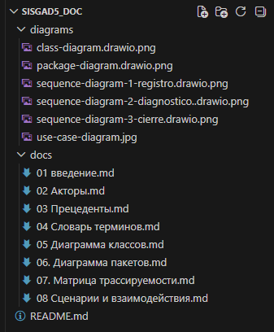

# SISGAD5_doc

_(Sistema de Gestión de Incidencias para ETECSA)_

---

## О проекте

_(Sobre el proyecto)_

Данный репозиторий содержит результаты моделирования системы управления инцидентами для телекоммуникационной компании ETECSA (Куба). Работа выполнена в рамках дисциплины Программирование корпоративных индустриальных систем».

_(Este repositorio contiene los resultados del modelado del sistema de gestión de incidencias para la empresa de telecomunicaciones ETECSA (Cuba). El trabajo se realizó en el marco de la disciplina Программирование корпоративных индустриальных систем».)_

**Студент:** Ботет Сесар Яисель  
**Группа:** ЭФМО-01-25  
**Преподаватель:** Макиевский Станислав Евгеньевич

---

## Цель проекта

_(Objetivo del proyecto)_

Разработка платформы автоматизации операций для телекоммуникационной компании, которая позволяет:

- Централизованно хранить данные о клиентах и инцидентах
- Автоматизировать процессы диагностики, назначения ремонтов и закрытия тикетов
- Обеспечить прослеживаемость действий и аудит
- Формировать аналитические отчеты для принятия решений

_(Desarrollar una plataforma de automatización de operaciones para la empresa de telecomunicaciones que permita:_

- _Almacenar centralizadamente datos de clientes e incidencias_
- _Automatizar procesos de diagnóstico, asignación de reparaciones y cierre de tickets_
- _Garantizar trazabilidad de acciones y auditoría_
- _Generar reportes analíticos para la toma de decisiones)_

---

## Структура репозитория

_(Estructura del repositorio)_

---

## Содержание практических работ

_(Contenido de los trabajos prácticos)_

| Практическая работа        | Описание                        | Документация                  |
| -------------------------- | ------------------------------- | ----------------------------- |
| **Практическая работа №1** | Карточка проекта                | `docs/01 Введение.md`         |
| **Практическая работа №2** | User Story Map                  | `docs/02 Акторы.md`           |
| **Практическая работа №3** | Event Storming                  | `docs/04 Словарь терминов.md` |
| **Практическая работа №4** | BPMN                            | _(включено в Event Storming)_ |
| **Практическая работа №5** | UML: статическое моделирование  | `docs/03-07`                  |
| **Практическая работа №6** | UML: динамическое моделирование | `docs/08`                     |

---

## Ключевые артефакты

_(Artefactos clave)_

| Артефакт                         | Описание                                                      |
| -------------------------------- | ------------------------------------------------------------- |
| **Диаграмма прецедентов**        | 24 прецедента, 7 акторов, связи include/extend/наследование   |
| **Диаграмма классов**            | 28 классов, 5 контекстов, атрибуты, методы, отношения         |
| **Диаграмма пакетов**            | 5 пакетов, правила зависимостей, Shared Kernel                |
| **Диаграммы последовательности** | 3 критических сценария с таблицами сообщений                  |
| **Словарь терминов**             | Унифицированный язык предметной области (Ubiquitous Language) |
| **Матрица трассируемости**       | Связь требований → прецедентов → классов                      |

---

## Акторы системы

_(Actores del sistema)_

| Актор                             | Роль                                                                                                                                                |
| --------------------------------- | --------------------------------------------------------------------------------------------------------------------------------------------------- |
| **Тестировщик**                   | Оператор первой линии. Принимает звонки, регистрирует клиентов, создает тикеты, проводит диагностику, регистрирует полевые работы, закрывает тикеты |
| **Редактор**                      | Администратор справочников. Наследует возможности тестировщика                                                                                      |
| **Супервизор**                    | Руководитель операций. Назначает техников, управляет назначениями, формирует отчеты                                                                 |
| **Администратор**                 | Управляет пользователями, ролями и разрешениями                                                                                                     |
| **Материальный менеджер**         | Регистрирует использованные материалы                                                                                                               |
| **Полевой техник**                | Выполняет ремонт на месте (внешний актор)                                                                                                           |
| **Неавторизованный пользователь** | Клиент, инициирующий обращение (внешний актор)                                                                                                      |

---

## Статистика модели

_(Estadísticas del modelo)_

| Показатель                | Количество |
| ------------------------- | ---------- |
| Прецеденты (Casos de uso) | 24         |
| Акторы (Actores)          | 7          |
| Классы (Clases)           | 28         |
| Пакеты (Paquetes)         | 5          |
| Контексты (Contextos)     | 5          |
| Требования (Requisitos)   | 16         |

---

## Ссылки

_(Enlaces)_

- **Репозиторий:** [https://github.com/ybotet/SISGAD5_doc](https://github.com/ybotet/SISGAD5_doc)
- **Инструменты:** Draw.io, Mermaid, Markdown

---


## Автор

_(Autor)_

**Ботет Сесар Яисель**  
Группа ЭФМО-01-25  
Институт перспективных технологий и индустриального программирования  
РТУ МИРЭА, Москва, 2026
