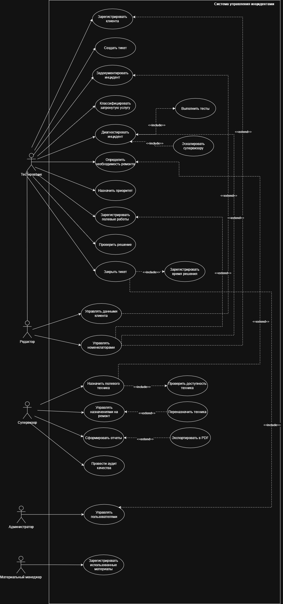

# Спецификация Прецедентов Использования

## 1. Список Прецедентов

| #   | Прецедент                                 | Актор                |
| --- | ----------------------------------------- | -------------------- |
| 1   | Зарегистрировать клиента                  | Тестировщик          |
| 2   | Управлять данными клиента                 | Редактор             |
| 3   | Создать тикет                             | Тестировщик          |
| 4   | Задокументировать инцидент                | Тестировщик          |
| 5   | Классифицировать затронутую услугу        | Тестировщик          |
| 6   | Диагностировать инцидент                  | Тестировщик          |
| 7   | Определить необходимость ремонта          | Тестировщик          |
| 8   | Назначить приоритет                       | Тестировщик          |
| 9   | Назначить полевого техника                | Супервизор           |
| 10  | Управлять назначениями на ремонт          | Супервизор           |
| 11  | Зарегистрировать полевые работы           | Тестировщик       |
| 12  | Проверить решение                         | Тестировщик          |
| 13  | Закрыть тикет                             | Тестировщик          |
| 14  | Управлять номенклаторами                  | Редактор             |
| 15  | Сформировать отчеты                       | Супервизор           |
| 16  | Провести аудит качества                   | Супервизор           |
| 17  | Управлять пользователями                  | Администратор        |
| 18  | Зарегистрировать использованные материалы | Материальный менедже |

## 2. Связи между прецедентами

### 2.1. Include (включение)

| Базовый прецедент          | Включаемый прецедент           | Причина                                                             |
| -------------------------- | ------------------------------ | ------------------------------------------------------------------- |
| Зарегистрировать клиента   | Проверить данные клиента       | Всегда проверяется, существует ли клиент, прежде чем создать нового |
| Диагностировать инцидент   | Выполнить тесты                | Всегда выполняются технические тесты в рамках диагностики           |
| Закрыть тикет              | Зарегистрировать время решения | Всегда регистрируется общее время решения                           |
| Назначить полевого техника | Проверить доступность техника  | Перед назначением проверяется, какие техники доступны               |

### 2.2. Extend (расширение)

| Базовый прецедент                | Расширяющий прецедент    | Причина                                                                                               |
| -------------------------------- | ------------------------ | ----------------------------------------------------------------------------------------------------- |
| Диагностировать инцидент         | Эскалировать супервизору | Если диагностика не может быть завершена, выполняется эскалация (исключительный случай)               |
| Управлять назначениями на ремонт | Переназначить техника    | Если назначенный техник не может выполнить работу, выполняется переназначение (альтернативный случай) |
| Сформировать отчеты              | Экспортировать в PDF     | Опционально, если супервизору нужно экспортировать отчет                                              |

### 2.3. Наследование

| Родительский актор | Дочерний актор | Причина                                                                   |
| ------------------ | -------------- | ------------------------------------------------------------------------- |
| Тестировщик        | Редактор       | Редактор имеет все возможности тестировщика плюс управление справочниками |

### 3. Прецеденты

## 3.1. Список Прецедентов

| #   | Прецедент                                 | Актор                  |
| --- | ----------------------------------------- | ---------------------- |
| 1   | Зарегистрировать клиента                  | Тестировщик            |
| 2   | Управлять данными клиента                 | Редактор               |
| 3   | Создать тикет                             | Тестировщик            |
| 4   | Задокументировать инцидент                | Тестировщик            |
| 5   | Классифицировать затронутую услугу        | Тестировщик            |
| 6   | Диагностировать инцидент                  | Тестировщик            |
| 7   | Определить необходимость ремонта          | Тестировщик            |
| 8   | Назначить приоритет                       | Тестировщик            |
| 9   | Назначить полевого техника                | Супервизор             |
| 10  | Управлять назначениями на ремонт          | Супервизор             |
| 11  | Зарегистрировать полевые работы           | Тестировщик            |
| 12  | Проверить решение                         | Тестировщик            |
| 13  | Закрыть тикет                             | Тестировщик            |
| 14  | Управлять номенклаторами                  | Редактор               |
| 15  | Сформировать отчеты                       | Супервизор             |
| 16  | Провести аудит качества                   | Супервизор             |
| 17  | Управлять пользователями                  | Администратор          |
| 18  | Зарегистрировать использованные материалы | Материальный менеджер  |
| 19  | Выполнить тесты                           | _включенный (include)_ |
| 20  | Проверить доступность техника             | _включенный (include)_ |
| 21  | Зарегистрировать время решения            | _включенный (include)_ |
| 22  | Эскалировать супервизору                  | _расширяющий (extend)_ |
| 23  | Переназначить техника                     | _расширяющий (extend)_ |
| 24  | Экспортировать в PDF                      | _расширяющий (extend)_ |

---

## 3.2. Связи между прецедентами

### 3.2.1. Include (включение)

| Базовый прецедент          | Включаемый прецедент           | Причина                                                   |
| -------------------------- | ------------------------------ | --------------------------------------------------------- |
| Диагностировать инцидент   | Выполнить тесты                | Всегда выполняются технические тесты в рамках диагностики |
| Назначить полевого техника | Проверить доступность техника  | Перед назначением проверяется, какие техники доступны     |
| Закрыть тикет              | Зарегистрировать время решения | Всегда регистрируется общее время решения                 |
| Закрыть тикет              | Управлять пользователями       | Для проверки прав пользователя на закрытие тикета         |

### 3.2.2. Extend (расширение)

| Базовый прецедент                | Расширяющий прецедент      | Причина                                                                     |
| -------------------------------- | -------------------------- | --------------------------------------------------------------------------- |
| Зарегистрировать клиента         | Управлять данными клиента  | Только если возникают проблемы с данными клиента                            |
| Задокументировать инцидент       | Управлять номенклаторами   | Если требуется создать/изменить тип инцидента во время документирования     |
| Диагностировать инцидент         | Управлять номенклаторами   | Если требуется создать/изменить ключ во время диагностики                   |
| Диагностировать инцидент         | Эскалировать супервизору   | Если диагностика не может быть завершена (исключительный случай)            |
| Зарегистрировать полевые работы  | Управлять номенклаторами   | Если требуется создать/изменить процедуру или материал во время регистрации |
| Определить необходимость ремонта | Назначить полевого техника | После определения необходимости ремонта, инициируется назначение техника    |
| Управлять назначениями на ремонт | Переназначить техника      | Если назначенный техник не может выполнить работу (альтернативный случай)   |
| Сформировать отчеты              | Экспортировать в PDF       | Опционально, если супервизору нужно экспортировать отчет                    |

### 3.2.3. Наследование (обобщение)

| Родительский актор | Дочерний актор | Причина                                                                   |
| ------------------ | -------------- | ------------------------------------------------------------------------- |
| Тестировщик        | Редактор       | Редактор имеет все возможности тестировщика плюс управление справочниками |

**Примечание:** Администратор **не** наследует от Супервизора. Администратор управляет только пользователями, ролями и разрешениями и не выполняет оперативные функции супервизора.

---

## 3.3. Акторы системы (справочно)

| Актор                             | Описание                                                                                                                                            |
| --------------------------------- | --------------------------------------------------------------------------------------------------------------------------------------------------- |
| **Тестировщик**                   | Оператор первой линии. Принимает звонки, регистрирует клиентов, создает тикеты, проводит диагностику, регистрирует полевые работы, закрывает тикеты |
| **Редактор**                      | Администратор справочников. Управляет номенклаторами и корректирует данные клиентов. Наследует все возможности тестировщика                         |
| **Супервизор**                    | Руководитель операций. Назначает техников, управляет назначениями, формирует отчеты, проводит аудит качества                                        |
| **Администратор**                 | Системный администратор. Управляет пользователями, ролями и разрешениями. Не наследует возможности супервизора                                      |
| **Материальный менеджер**         | Ответственный за регистрацию материалов, использованных в ремонтах, и контроль запасов                                                              |
| **Полевой техник**                | Персонал, выполняющий ремонт на месте. Не взаимодействует с системой напрямую; сообщает о выполненных действиях тестировщику                        |
| **Неавторизованный пользователь** | Клиент, который звонит по телефону с сообщением о неисправности, не имея авторизации в системе. Инициирует процесс создания тикета                  |

---

## 3.4. Детальное Описание Ключевых Прецедентов

### 3.4.1. Диагностировать инцидент

| Элемент                   | Описание                                                                                                                                                                       |
| ------------------------- | ------------------------------------------------------------------------------------------------------------------------------------------------------------------------------ |
| **Название**              | Диагностировать инцидент                                                                                                                                                       |
| **Основной актор**        | Тестировщик                                                                                                                                                                    |
| **Второстепенные акторы** | Внешняя система диагностики                                                                                                                                                    |
| **Предусловие**           | Тикет создан и находится в статусе "Открыто"                                                                                                                                   |
| **Постусловие**           | Диагноз зарегистрирован, определено: требуется ремонт или быстрое решение                                                                                                      |
| **Бизнес-правила**        | БП-001: Тестирование должно быть завершено максимум за 10 минут. БП-002: Если причина сбоя не выявлена, необходимо обратиться к руководителю для дальнейшего расследования. |

#### Основной поток

| Шаг | Действие                                                       | Проверка                                    | Требуемые данные                       |
| --- | -------------------------------------------------------------- | ------------------------------------------- | -------------------------------------- |
| 1   | Тестировщик выбирает активный тикет из списка ожидания         | Тикет должен быть в статусе "Открыто"       | ID тикета                              |
| 2   | Система отображает данные клиента и затронутой услуги          | Данные должны быть полными                  | Данные клиента, тип услуги, ID объекта |
| 3   | Тестировщик выполняет диагностические тесты из внешней системы | Внешняя система должна быть доступна        | Команды тестирования                   |
| 4   | Тестировщик вводит результаты тестов в систему                 | Результаты должны быть в корректном формате | Ключ к результатам теста               |
| 5   | Тестировщик оценивает возможность удаленного решения           | На основе причины и результатов тестов      | Критерии матрицы принятия решений      |
| 6   | Система сохраняет диагноз и фиксирует решение                  | Все обязательные поля должны быть заполнены | Полный диагноз, решение                |

#### Альтернативные потоки

| Сценарий | Условие                                 | Действие системы                                                                     | Результат                                             |
| -------- | --------------------------------------- | ------------------------------------------------------------------------------------ | ----------------------------------------------------- |
| A1       | Внешняя система диагностики не отвечает | Система позволяет повторить попытку до 3 раз. При повторении уведомляет тестировщика | Тикет в статусе "В Процессе Разработки"               |
| A2       | Результаты тестов вне диапазона         | Система автоматически отмечает "Требуется ремонт"                                    | Шаг 5 пропускается, решение фиксируется автоматически |
| A3       | Корневая причина не определена          | Система предлагает вероятные причины. Тестировщик выбирает "Не определена"           | Тикет переходит в статус "Проверка супервизором"      |

#### Исключения

| Исключение                          | Причина                                       | Действие системы                                                                                   |
| ----------------------------------- | --------------------------------------------- | -------------------------------------------------------------------------------------------------- |
| E1 - Превышение времени диагностики | Диагностика длится более 10 минут             | Система продолжает работать, но фиксирует предупреждение о превышении времени ожидания для метрик. |
| E2 - Неполные данные клиента        | У клиента нет контактных данных или адреса    | Система блокирует диагностику и запрашивает заполнение данных                                      |
| E3 - Конфликт параллельной работы   | Другой тестировщик диагностирует тот же тикет | Система отклоняет операцию и показывает сообщение о конфликте                                      |

#### Требования к данным

| Данные            | Тип           | Источник    | Обязательность |
| ----------------- | ------------- | ----------- | -------------- |
| ID тикета         | Целое число   | Система     | Обязательный   |
| ID клиента        | Целое число   | База данных | Обязательный   |
| Тип услуги        | Текст         | Номенклатор | Обязательный   |
| Результаты тестов | JSON          | Ручной ввод | Обязательный   |
| Корневая причина  | Текст         | Номенклатор | Обязательный   |
| Время диагностики | Метка времени | Система     | Автоматический |

---

### 3.4.2. Назначить полевого техника

| Элемент                   | Описание                                                                |
| ------------------------- | ----------------------------------------------------------------------- |
| **Название**              | Назначить полевого техника                                              |
| **Основной актор**        | Супервизор                                                              |
| **Предусловие**           | Диагноз определил, что требуется ремонт                                 |
| **Постусловие**           | Полевой техник назначен на тикет, тикет добавлен в очередь назначений   |
| **Бизнес-правила**        | БП-003: Техник не может иметь более 8 активных назначений одновременно. |

#### Основной поток

| Шаг | Действие                                                                       | Проверка                                                           | Требуемые данные                                            |
| --- | ------------------------------------------------------------------------------ | ------------------------------------------------------------------ | ----------------------------------------------------------- |
| 1   | Супервизор открывает список тикетов, ожидающих назначения                      | Супервизор должен иметь права на назначение                        | Список, отфильтрованный по статусу "Требуется ремонт"       |
| 2   | Система отображает тикеты, требующие ремонта, с приоритетами                   | Приоритет должен быть рассчитан по матрице критичности             | Приоритет (1-5), прошедшее время, географическая зона       |
| 3   | Супервизор выбирает тикет и просматривает полные детали                        | Тикет должен быть в статусе, допустимом для назначения             | ID тикета, данные о местоположении, детали неисправности    |
| 4   | Система отображает список доступных полевых техников                           | Только активные техники с доступной емкостью (менее 8 назначений)  | ID техника, специализация, текущее местоположение, загрузка |
| 5   | Супервизор выбирает техника с учетом местоположения, специализации и загрузки  | Техник должен иметь требуемую специализацию для типа неисправности | Примененные критерии отбора                                 |
| 6   | Система проверяет отсутствие конфликтов в расписании техника                   | Не должно быть пересекающихся назначений в одно время              | Расписание техника, расчетная длительность ремонта          |
| 7   | Система регистрирует назначение и обновляет статус тикета на "Ремонт назначен" | Все обязательные поля должны быть заполнены                        | ID назначения, назначенный техник                           |
| 8   | Система отправляет уведомление назначенному технику                            | У техника должен быть настроен контакт                             | Email, SMS или push-уведомление                             |

#### Альтернативные потоки

| Сценарий | Условие                                        | Действие системы                                                                                                                 | Результат                                                                           |
| -------- | ---------------------------------------------- | -------------------------------------------------------------------------------------------------------------------------------- | ----------------------------------------------------------------------------------- |
| A1       | Нет доступных техников                         | Система показывает техников с наименьшей загрузкой. Супервизор может назначить техника с превышением 8 назначений с обоснованием | Тикет в статусе "Исключительное назначение" при обосновании, или "Ожидание техника" |
| A2       | Выбранный техник не имеет нужной специализации | Система автоматически фильтрует только техников с нужной специализацией                                                          | Отображается предупреждение, предлагается другой техник                             |
| A3       | Техник отклоняет назначение                    | Система регистрирует отказ и уведомляет супервизора                                                                              | Супервизор должен переназначить. Фиксируется в аудите                               |

#### Исключения

| Исключение               | Причина                                              | Действие системы                                                |
| ------------------------ | ---------------------------------------------------- | --------------------------------------------------------------- |
| E1 - Дублирование тикета | На тикет уже есть активное назначение                | Система отклоняет операцию и показывает текущий статус          |
| E2 - Техник неактивен    | Выбранный техник был деактивирован во время операции | Система отменяет назначение и запрашивает выбор другого техника |

#### Требования к данным

| Данные              | Тип               | Источник       | Обязательность |
| ------------------- | ----------------- | -------------- | -------------- |
| ID тикета           | Целое число       | Система        | Обязательный   |
| Приоритет           | Целое число (1-5) | Система        | Обязательный   |
| Географическая зона | Текст             | Данные клиента | Обязательный   |
| ID техника          | Целое число       | База данных    | Обязательный   |
| Специализация       | Текст             | Номенклатор    | Обязательный   |
| ID назначения       | Целое число       | Система        | Автоматический |

---

### 3.4.3. Зарегистрировать полевые работы

| Элемент                   | Описание                                                                           |
| ------------------------- | ---------------------------------------------------------------------------------- |
| **Название**              | Зарегистрировать полевые работы                                                    |
| **Основной актор**        | Тестировщик                                                                        |
| **Предусловие**           | Полевой техник завершил ремонт и сообщил о выполненных действиях                   |
| **Постусловие**           | Выполненные полевые работы задокументированы в тикете                              |
| **Бизнес-правила**        | БП-004: Время полевых работ должно регистрироваться для расчета производительности |

#### Основной поток

| Шаг | Действие                                                                              | Проверка                                            | Требуемые данные                                     |
| --- | ------------------------------------------------------------------------------------- | --------------------------------------------------- | ---------------------------------------------------- |
| 1   | Тестировщик открывает соответствующий тикет                                           | Тикет должен быть в статусе "Ремонт назначен"       | ID тикета                                            |
| 2   | Тестировщик получает от полевого техника отчет о выполненных действиях                | Техник должен предоставить полную информацию        | Устная коммуникация или письменный отчет             |
| 3   | Тестировщик регистрирует выполненные действия в системе                               | Действия должны выбираться из номенклатора процедур | Примененные процедуры, длительность каждой процедуры |
| 4   | Тестировщик регистрирует наблюдения и результаты ремонта                              | Наблюдения должны быть четкими и детальными         | Технические наблюдения, полученные результаты        |
| 5   | Тестировщик подтверждает, что ремонт завершен и решение проверено                     | Должно быть подтверждение от техника                | Результат проверки                                   |
| 6   | Система обновляет статус тикета на "Ремонт завершен - ожидает регистрации материалов" | Все обязательные поля должны быть заполнены         | Обновленный статус, отметка времени завершения       |
| 7   | Система уведомляет материального менеджера, что тикет готов к регистрации материалов  | Материальный менеджер должен быть активен в системе | Уведомление в панели материального менеджера         |

#### Альтернативные потоки

| Сценарий | Условие                                            | Действие системы                                                                    | Результат                                                                        |
| -------- | -------------------------------------------------- | ----------------------------------------------------------------------------------- | -------------------------------------------------------------------------------- |
| A1       | Техник сообщает, что ремонт не может быть завершен | Тестировщик документирует причину (отсутствие доступа, более серьезное повреждение) | Тикет в статусе "Ожидание". Супервизор проверяет и определяет следующие действия |
| A2       | Решение не может быть проверено                    | Тестировщик документирует, что услуга не восстановлена полностью                    | Тикет требует дополнительной диагностики. Повторное назначение тестировщику      |

#### Исключения

| Исключение                          | Причина                                      | Действие системы                                                                                       |
| ----------------------------------- | -------------------------------------------- | ------------------------------------------------------------------------------------------------------ |
| E1 - Неполная информация от техника | Техник не предоставляет все требуемые данные | Система позволяет сохранить черновик. Тестировщик должен завершить информацию перед изменением статуса |

---

### 3.4.4. Зарегистрировать использованные материалы

| Элемент            | Описание                                                                                                        |
| ------------------ | --------------------------------------------------------------------------------------------------------------- |
| **Название**       | Зарегистрировать использованные материалы                                                                       |
| **Основной актор** | Материальный менеджер                                                                                           |
| **Предусловие**    | Тикет в статусе "Ремонт завершен - ожидает регистрации материалов". Техник сообщил об использованных материалах |
| **Постусловие**    | Использованные материалы зарегистрированы в системе, инвентарь обновлен                                         |
| **Бизнес-правила** | БП-005: Нельзя закрыть тикет без регистрации использованных материалов                                          |

#### Основной поток

| Шаг | Действие                                                                         | Проверка                                                     | Требуемые данные                                                                      |
| --- | -------------------------------------------------------------------------------- | ------------------------------------------------------------ | ------------------------------------------------------------------------------------- |
| 1   | Материальный менеджер открывает список тикетов, ожидающих регистрации материалов | Пользователь должен иметь роль "Материальный менеджер"       | Список, отфильтрованный по статусу "Ремонт завершен - ожидает регистрации материалов" |
| 2   | Материальный менеджер выбирает тикет                                             | Тикет должен быть в допустимом статусе                       | ID тикета, данные о ремонте                                                           |
| 3   | Материальный менеджер регистрирует использованные детали и материалы             | Каждая деталь должна существовать в номенклаторе инвентаря   | Код детали, количество, серийный номер (при наличии)                                  |
| 4   | Система проверяет наличие на складе                                              | Детали должны быть зарегистрированы в системе инвентаризации | Текущий запас, место хранения                                                         |
| 5   | Система обновляет инвентарь, вычитая использованные количества                   | Количества не могут быть отрицательными                      | Новый запас, дата движения                                                            |
| 6   | Материальный менеджер подтверждает регистрацию                                   | Все материалы должны быть зарегистрированы                   | Подтверждение регистрации                                                             |
| 7   | Система обновляет статус тикета на "Ожидает закрытия"                            | Все обязательные поля должны быть заполнены                  | Обновленный статус                                                                    |
| 8   | Система уведомляет тестировщика, что тикет готов к закрытию                      | Тестировщик должен быть активен в системе                    | Уведомление в панели тестировщика                                                     |

#### Альтернативные потоки

| Сценарий | Условие                              | Действие системы                                                                           | Результат                                                      |
| -------- | ------------------------------------ | ------------------------------------------------------------------------------------------ | -------------------------------------------------------------- |
| A1       | Материал отсутствует на складе       | Материальный менеджер отмечает деталь как "Нет в наличии". Система отмечает для пополнения | Тикет в статусе "Ожидание материалов". Уведомление супервизору |
| A2       | Техник сообщил о неверных материалах | Материальный менеджер может скорректировать количества или детали                          | Корректировка регистрируется в журнале аудита                  |

#### Исключения

| Исключение                              | Причина                                          | Действие системы                                                     |
| --------------------------------------- | ------------------------------------------------ | -------------------------------------------------------------------- |
| E1 - Материалы не зарегистрированы      | Попытка закрыть тикет без регистрации материалов | Система блокирует закрытие тикета до регистрации материалов          |
| E2 - Отрицательное количество на складе | Попытка списать больше, чем доступно             | Система отклоняет операцию и показывает ошибку недостаточного запаса |

---

## 3.5. Сводная таблица акторов и прецедентов

| Актор                             | Прецеденты                                                                                                                                                                                                                                                  |
| --------------------------------- | ----------------------------------------------------------------------------------------------------------------------------------------------------------------------------------------------------------------------------------------------------------- |
| **Тестировщик**                   | Зарегистрировать клиента, Создать тикет, Задокументировать инцидент, Классифицировать затронутую услугу, Диагностировать инцидент, Определить необходимость ремонта, Назначить приоритет, Зарегистрировать полевые работы, Проверить решение, Закрыть тикет |
| **Редактор**                      | Управлять данными клиента, Управлять номенклаторами _(наследует все прецеденты Тестировщика)_                                                                                                                                                               |
| **Супервизор**                    | Назначить полевого техника, Управлять назначениями на ремонт, Сформировать отчеты, Провести аудит качества                                                                                                                                                  |
| **Администратор**                 | Управлять пользователями                                                                                                                                                                                                                                    |
| **Материальный менеджер**         | Зарегистрировать использованные материалы                                                                                                                                                                                                                   |
| **Полевой техник**                | _Не имеет прямых прецедентов (внешний актор, источник информации для "Зарегистрировать полевые работы")_                                                                                                                                                    |
| **Неавторизованный пользователь** | _Не имеет прямых прецедентов (внешний актор, инициирует процесс создания тикета)_                                                                                                                                                                           |

---

## 3.6. Сводная таблица связей

| Тип связи        | От (источник)                    | К (цель)                       |
| ---------------- | -------------------------------- | ------------------------------ |
| **Include**      | Диагностировать инцидент         | Выполнить тесты                |
| **Include**      | Назначить полевого техника       | Проверить доступность техника  |
| **Include**      | Закрыть тикет                    | Зарегистрировать время решения |
| **Include**      | Закрыть тикет                    | Управлять пользователями       |
| **Extend**       | Зарегистрировать клиента         | Управлять данными клиента      |
| **Extend**       | Задокументировать инцидент       | Управлять номенклаторами       |
| **Extend**       | Диагностировать инцидент         | Управлять номенклаторами       |
| **Extend**       | Диагностировать инцидент         | Эскалировать супервизору       |
| **Extend**       | Зарегистрировать полевые работы  | Управлять номенклаторами       |
| **Extend**       | Определить необходимость ремонта | Назначить полевого техника     |
| **Extend**       | Управлять назначениями на ремонт | Переназначить техника          |
| **Extend**       | Сформировать отчеты              | Экспортировать в PDF           |
| **Наследование** | Редактор                         | Тестировщик                    |

---

## 3.7. Примечания

1. **Редактор** наследует от **Тестировщика**: может выполнять все действия тестировщика, плюс управление справочниками и данными клиентов.
2. **Администратор** **не** наследует от **Супервизора**: его функции независимы (только управление пользователями, ролями и разрешениями).
3. **Управлять номенклаторами** является `<<extend>>`, который может вызываться из нескольких прецедентов: задокументировать инцидент, диагностировать, зарегистрировать полевые работы.
4. **Полевой техник** и **Неавторизованный пользователь** остаются на диаграмме как внешние акторы для объяснения источника информации и начала процесса, хотя у них нет прямых ассоциаций с прецедентами.
5. **Закрыть тикет** включает `Управлять пользователями` для проверки прав пользователя на закрытие тикета.
