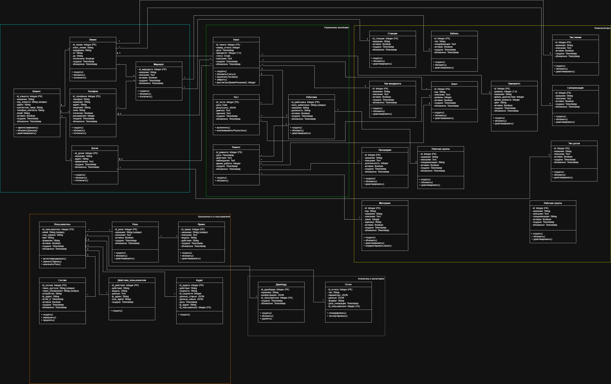
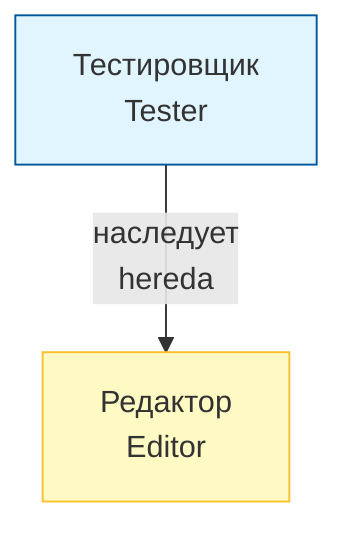

# 5. Диаграмма классов предметной области

_(Diagrama de Clases del Dominio)_

---

## 5.1. Условные обозначения

_(Leyenda)_

| Символ      | Значение                   | _(Español)_               |
| ----------- | -------------------------- | ------------------------- |
| `+`         | Открытый                   | _(Público / public)_      |
| `-`         | Закрытый                   | _(Privado / private)_     |
| `#`         | Защищенный                 | _(Protegido / protected)_ |
| `1`         | Один                       | _(Uno)_                   |
| `*` или `N` | Многие                     | _(Muchos)_                |
| `◆`         | Композиция (сильная связь) | _(Composición / fuerte)_  |
| `◇`         | Агрегация (слабая связь)   | _(Agregación / débil)_    |
| `△`         | Наследование               | _(Herencia)_              |

---

## 5.2. Классы предметной области

_(Clases del Dominio)_

---

### Контекст 1: Управление клиентами

_(Contexto: Gestión de Clientes)_

---

#### Класс 1: Клиент _(Clase: Cliente)_

**Атрибуты** _(Atributos)_:

| Атрибут            | Тип             | Описание _(Descripción)_   |
| ------------------ | --------------- | -------------------------- |
| - id_клиента       | Integer (PK)    | Уникальный идентификатор   |
| - название         | String          | Наименование клиента       |
| - код_клиента      | String (unique) | Уникальный код клиента     |
| - адрес            | String          | Физический адрес           |
| - контактное_лицо  | String          | Контактное лицо            |
| - телефон_контакта | String          | Контактный телефон         |
| - email            | String          | Электронная почта          |
| - активен          | Boolean         | Статус (активен/неактивен) |
| - создано          | Timestamp       | Дата создания              |
| - обновлено        | Timestamp       | Дата последнего обновления |

**Методы** _(Métodos)_:

| Метод                | Описание _(Descripción)_        |
| -------------------- | ------------------------------- |
| + зарегистрировать() | Зарегистрировать нового клиента |
| + обновитьДанные()   | Обновить данные клиента         |
| + деактивировать()   | Деактивировать клиента          |

**Связи** _(Relaciones)_:

- `1` → `*` **Телефон** _(один клиент может иметь несколько телефонов)_
- `1` → `*` **Линия** _(один клиент может иметь несколько линий)_

---

#### Класс 2: Телефон _(Clase: Teléfono)_

**Атрибуты** _(Atributos)_:

| Атрибут       | Тип          | Описание _(Descripción)_    |
| ------------- | ------------ | --------------------------- |
| - id_телефона | Integer (PK) | Уникальный идентификатор    |
| - телефон     | String       | Номер телефона              |
| - название    | String       | Описательное название       |
| - адрес       | String       | Адрес установки             |
| - лицензия    | String       | Номер лицензии              |
| - зона        | String       | Географическая зона         |
| - отключен    | Boolean      | Статус (подключен/отключен) |
| - расширения  | Integer      | Количество расширений       |
| - создано     | Timestamp    | Дата создания               |
| - обновлено   | Timestamp    | Дата последнего обновления  |

**Методы** _(Métodos)_:

| Метод         | Описание _(Descripción)_ |
| ------------- | ------------------------ |
| + создать()   | Создать новый телефон    |
| + обновить()  | Обновить данные телефона |
| + отключить() | Отключить телефон        |

**Связи** _(Relaciones)_:

- `*` → `1` **Клиент** _(принадлежит одному клиенту)_
- `*` → `1` **Маршрут** _(имеет один маршрут до станции)_
- `*` → `1` **Рабочая группа** _(принадлежит одной рабочей группе)_ _(из контекста Номенклаторы)_
- `1` → `*` **Тикет** _(может иметь несколько тикетов)_ _(из контекста Управление жалобами)_

---

#### Класс 3: Линия _(Clase: Línea)_

**Атрибуты** _(Atributos)_:

| Атрибут      | Тип          | Описание _(Descripción)_   |
| ------------ | ------------ | -------------------------- |
| - id_линии   | Integer (PK) | Уникальный идентификатор   |
| - ключ_линии | String       | Ключ линии                 |
| - кодировка  | String       | Кодировка линии            |
| - от         | String       | Начальная точка            |
| - до         | String       | Конечная точка             |
| - отключена  | Boolean      | Статус (активна/отключена) |
| - создано    | Timestamp    | Дата создания              |
| - обновлено  | Timestamp    | Дата последнего обновления |

**Методы** _(Métodos)_:

| Метод         | Описание _(Descripción)_ |
| ------------- | ------------------------ |
| + создать()   | Создать новую линию      |
| + обновить()  | Обновить данные линии    |
| + отключить() | Отключить линию          |

**Связи** _(Relaciones)_:

- `*` → `1` **Клиент** _(принадлежит одному клиенту)_
- `*` → `1` **Маршрут** _(имеет один маршрут до станции)_
- `*` → `1` **Тип линии** _(имеет один тип линии)_ _(из контекста Номенклаторы)_
- `*` → `1` **Кабель** _(имеет один тип кабеля)_ _(из контекста Номенклаторы)_
- `*` → `1` **Сигнализация** _(может иметь один тип сигнализации)_ _(из контекста Номенклаторы)_
- `1` → `*` **Тикет** _(может иметь несколько тикетов)_ _(из контекста Управление жалобами)_

---

#### Класс 4: Маршрут _(Clase: Recorrido)_

**Атрибуты** _(Atributos)_:

| Атрибут       | Тип          | Описание _(Descripción)_   |
| ------------- | ------------ | -------------------------- |
| - id_маршрута | Integer (PK) | Уникальный идентификатор   |
| - название    | String       | Название маршрута          |
| - описание    | Text         | Описание маршрута          |
| - активен     | Boolean      | Статус (активен/неактивен) |
| - создано     | Timestamp    | Дата создания              |
| - обновлено   | Timestamp    | Дата последнего обновления |

**Методы** _(Métodos)_:

| Метод              | Описание _(Descripción)_ |
| ------------------ | ------------------------ |
| + создать()        | Создать новый маршрут    |
| + обновить()       | Обновить данные маршрута |
| + деактивировать() | Деактивировать маршрут   |

**Связи** _(Relaciones)_:

- `*` → `1` **Станция** _(принадлежит одной станции)_ _(из контекста Номенклаторы)_
- `1` → `*` **Телефон** _(один маршрут может быть у нескольких телефонов)_
- `1` → `*` **Линия** _(один маршрут может быть у нескольких линий)_

---

### Контекст 2: Управление жалобами

_(Contexto: Gestión de Incidencias)_

---

#### Класс 5: Доска _(Clase: Pizarra)_

**Атрибуты** _(Atributos)_:

| Атрибут      | Тип          | Описание _(Descripción)_   |
| ------------ | ------------ | -------------------------- |
| - id_доски   | Integer (PK) | Уникальный идентификатор   |
| - название   | String       | Наименование доски         |
| - адрес      | String       | Адрес расположения         |
| - примечание | Text         | Дополнительные примечания  |
| - создано    | Timestamp    | Дата создания              |
| - обновлено  | Timestamp    | Дата последнего обновления |

**Методы** _(Métodos)_:

| Метод        | Описание _(Descripción)_ |
| ------------ | ------------------------ |
| + создать()  | Создать новую доску      |
| + обновить() | Обновить данные доски    |
| + удалить()  | Удалить доску            |

**Связи** _(Relaciones)_:

- `*` → `1` **Клиент** _(принадлежит одному клиенту)_
- `*` → `1` **Тип доски** _(имеет один тип доски)_ _(из контекста Номенклаторы)_
- `1` → `*` **Тикет** _(может иметь несколько тикетов)_ _(из контекста Управление жалобами)_

---

#### Класс 6: Тикет _(Clase: Ticket)_

**Атрибуты** _(Atributos)_:

| Атрибут        | Тип           | Описание _(Descripción)_   |
| -------------- | ------------- | -------------------------- |
| - id_тикета    | Integer (PK)  | Уникальный идентификатор   |
| - номер_отчета | Integer       | Номер отчета               |
| - дата         | Timestamp     | Дата создания              |
| - приоритет    | Integer (1-5) | Уровень приоритета         |
| - статус       | Enum          | Статус тикета              |
| - описание     | Text          | Описание проблемы          |
| - создано      | Timestamp     | Дата создания              |
| - обновлено    | Timestamp     | Дата последнего обновления |

**Методы** _(Métodos)_:

| Метод                               | Описание _(Descripción)_ |
| ----------------------------------- | ------------------------ |
| + создать()                         | Создать новый тикет      |
| + обновитьСтатус()                  | Обновить статус тикета   |
| + назначитьТехника()                | Назначить техника        |
| + закрыть()                         | Закрыть тикет            |
| + рассчитатьВремяРешения(): Integer | Рассчитать время решения |

**Ограничение** _(Restricción)_: Должен быть связан хотя бы с одним объектом (Телефон, Линия или Станция) _(Debe estar asociado al menos a un objeto: Teléfono, Línea o Planta)_

**Связи** _(Relaciones)_:

- `*` → `0..1` **Телефон** _(опционально, ссылка на затронутый телефон)_
- `*` → `0..1` **Линия** _(опционально, ссылка на затронутую линию)_
- `*` → `0..1` **Доска** _(опционально, ссылка на затронутую Доску)_
- `*` → `1` **Тип инцидента** _(имеет один тип инцидента)_ _(из контекста Номенклаторы)_
- `*` → `1` **Ключ** _(имеет один код статуса)_ _(из контекста Номенклаторы)_
- `*` → `1` **Приоритет** _(имеет один уровень приоритета)_ _(из контекста Номенклаторы)_
- `1` → `*` **Тест** _(может иметь несколько тестов)_
- `1` → `*` **Ремонт** _(может иметь несколько ремонтов)_

---

#### Класс 7: Тест _(Clase: Prueba / Diagnóstico)_

**Атрибуты** _(Atributos)_:

| Атрибут      | Тип          | Описание _(Descripción)_   |
| ------------ | ------------ | -------------------------- |
| - id_теста   | Integer (PK) | Уникальный идентификатор   |
| - дата       | Date         | Дата теста                 |
| - результаты | JSON         | Результаты тестов          |
| - диагноз    | Text         | Диагноз                    |
| - причина    | Text         | Корневая причина           |
| - создано    | Timestamp    | Дата создания              |
| - обновлено  | Timestamp    | Дата последнего обновления |

**Методы** _(Métodos)_:

| Метод                       | Описание _(Descripción)_ |
| --------------------------- | ------------------------ |
| + выполнить()               | Выполнить тест           |
| + анализироватьРезультаты() | Анализировать результаты |

**Связи** _(Relaciones)_:

- `*` → `1` **Тикет** _(принадлежит одному тикету)_
- `*` → `1` **Работник** _(выполнен одним работником)_
- `*` → `1` **Ключ** _(имеет один код результата)_ _(из контекста Номенклаторы)_

---

#### Класс 8: Ремонт _(Clase: Reparación)_

**Атрибуты** _(Atributos)_:

| Атрибут        | Тип          | Описание _(Descripción)_   |
| -------------- | ------------ | -------------------------- |
| - id_ремонта   | Integer (PK) | Уникальный идентификатор   |
| - дата         | Timestamp    | Дата ремонта               |
| - действия     | Text         | Выполненные действия       |
| - наблюдения   | Text         | Наблюдения                 |
| - время_работы | Integer      | Время работы (минуты)      |
| - создано      | Timestamp    | Дата создания              |
| - обновлено    | Timestamp    | Дата последнего обновления |

**Методы** _(Métodos)_:

| Метод        | Описание _(Descripción)_ |
| ------------ | ------------------------ |
| + создать()  | Создать запись о ремонте |
| + обновить() | Обновить данные ремонта  |

**Связи** _(Relaciones)_:

- `*` → `1` **Тикет** _(принадлежит одному тикету)_
- `*` → `1` **Работник** _(зарегистрирован одним работником)_
- `*` → `1` **Ключ** _(имеет один код статуса)_ _(из контекста Номенклаторы)_
- `*` ↔ `*` **Процедура** _(может использовать несколько процедур)_ — **N:M** _(из контекста Номенклаторы)_
- `*` ↔ `*` **Материал** _(может использовать несколько материалов)_ — **N:M** _(из контекста Номенклаторы)_

---

#### Класс 9: Работник _(Clase: Trabajador)_

**Атрибуты** _(Atributos)_:

| Атрибут          | Тип             | Описание _(Descripción)_   |
| ---------------- | --------------- | -------------------------- |
| - id_работника   | Integer (PK)    | Уникальный идентификатор   |
| - ключ_работника | String (unique) | Уникальный код работника   |
| - название       | String          | ФИО работника              |
| - должность      | String          | Должность                  |
| - активен        | Boolean         | Статус (активен/неактивен) |
| - создано        | Timestamp       | Дата создания              |
| - обновлено      | Timestamp       | Дата последнего обновления |

**Методы** _(Métodos)_:

| Метод              | Описание _(Descripción)_   |
| ------------------ | -------------------------- |
| + создать()        | Создать запись о работнике |
| + обновить()       | Обновить данные работника  |
| + деактивировать() | Деактивировать работника   |

**Связи** _(Relaciones)_:

- `*` → `1` **Рабочая группа** _(принадлежит одной рабочей группе)_ _(из контекста Номенклаторы)_
- `1` → `*` **Тест** _(может выполнять несколько тестов)_
- `1` → `*` **Ремонт** _(может регистрировать несколько ремонтов)_

---

### Контекст 3: Номенклаторы (Справочники) — Shared Kernel

_(Contexto: Nomenclátores / Catálogos — Shared Kernel)_

**Описание контекста** _(Descripción del contexto)_:

Этот контекст содержит все справочники (каталоги) системы. Номенклаторы используются во всех остальных контекстах как общее ядро (Shared Kernel). Каждый номенклатор является независимым классом, представляющим список предопределенных значений. Наследование между ними отсутствует.

_(Este contexto contiene todos los catálogos del sistema. Los nomenclátores se utilizan en todos los demás contextos como núcleo compartido (Shared Kernel). Cada nomenclátor es una clase independiente que representa una lista de valores predefinidos. No existe herencia entre ellos.)_

---

#### Класс 10: Станция _(Clase: Planta)_

**Атрибуты** _(Atributos)_:

| Атрибут      | Тип          | Описание _(Descripción)_   |
| ------------ | ------------ | -------------------------- |
| - id_станции | Integer (PK) | Уникальный идентификатор   |
| - название   | String       | Название станции           |
| - активен    | Boolean      | Статус (активен/неактивен) |
| - создано    | Timestamp    | Дата создания              |
| - обновлено  | Timestamp    | Дата последнего обновления |

**Методы** _(Métodos)_:

| Метод              | Описание _(Descripción)_ |
| ------------------ | ------------------------ |
| + создать()        | Создать новую станцию    |
| + обновить()       | Обновить данные станции  |
| + деактивировать() | Деактивировать станцию   |

**Связи** _(Relaciones)_:

- `1` → `*` **Маршрут** _(одна станция может иметь несколько маршрутов)_ _(из контекста Управление клиентами)_
- `1` → `*` **Тикет** _(одна станция может иметь несколько тикетов)_ _(из контекста Управление жалобами)_

---

#### Класс 11: Тип инцидента _(Clase: Tipo de incidencia)_

**Атрибуты** _(Atributos)_:

| Атрибут     | Тип          | Описание _(Descripción)_   |
| ----------- | ------------ | -------------------------- |
| - id        | Integer (PK) | Уникальный идентификатор   |
| - название  | String       | Название типа инцидента    |
| - описание  | Text         | Описание                   |
| - активен   | Boolean      | Статус (активен/неактивен) |
| - создано   | Timestamp    | Дата создания              |
| - обновлено | Timestamp    | Дата последнего обновления |

**Методы** _(Métodos)_:

| Метод              | Описание _(Descripción)_    |
| ------------------ | --------------------------- |
| + создать()        | Создать новый тип инцидента |
| + обновить()       | Обновить данные             |
| + деактивировать() | Деактивировать              |

**Связи** _(Relaciones)_:

- `1` → `*` **Тикет** _(один тип может быть в нескольких тикетах)_ _(из контекста Управление жалобами)_

---

#### Класс 12: Ключ _(Clase: Clave)_

**Атрибуты** _(Atributos)_:

| Атрибут     | Тип          | Описание _(Descripción)_   |
| ----------- | ------------ | -------------------------- |
| - id        | Integer (PK) | Уникальный идентификатор   |
| - код       | String       | Код                        |
| - описание  | Text         | Описание кода              |
| - уровень   | Integer      | Уровень детализации        |
| - активен   | Boolean      | Статус (активен/неактивен) |
| - создано   | Timestamp    | Дата создания              |
| - обновлено | Timestamp    | Дата последнего обновления |

**Методы** _(Métodos)_:

| Метод              | Описание _(Descripción)_ |
| ------------------ | ------------------------ |
| + создать()        | Создать новый ключ       |
| + обновить()       | Обновить данные ключа    |
| + деактивировать() | Деактивировать ключ      |

**Связи** _(Relaciones)_:

- `1` → `*` **Тикет** _(один код может быть в нескольких тикетах как статус)_ _(из контекста Управление жалобами)_
- `1` → `*` **Тест** _(один код может быть в нескольких тестах как результат)_ _(из контекста Управление жалобами)_
- `1` → `*` **Ремонт** _(один код может быть в нескольких ремонтах как статус)_ _(из контекста Управление жалобами)_

---

#### Класс 13: Рабочая группа _(Clase: Grupo de trabajo)_

**Атрибуты** _(Atributos)_:

| Атрибут         | Тип          | Описание _(Descripción)_   |
| --------------- | ------------ | -------------------------- |
| - id            | Integer (PK) | Уникальный идентификатор   |
| - название      | String       | Название группы            |
| - описание      | Text         | Описание группы            |
| - специализация | String       | Специализация группы       |
| - активен       | Boolean      | Статус (активен/неактивен) |
| - создано       | Timestamp    | Дата создания              |
| - обновлено     | Timestamp    | Дата последнего обновления |

**Методы** _(Métodos)_:

| Метод              | Описание _(Descripción)_     |
| ------------------ | ---------------------------- |
| + создать()        | Создать новую рабочую группу |
| + обновить()       | Обновить данные группы       |
| + деактивировать() | Деактивировать группу        |

**Связи** _(Relaciones)_:

- `1` → `*` **Работник** _(одна группа может иметь несколько работников)_ _(из контекста Управление жалобами)_

---

#### Класс 14: Кабель _(Clase: Cable)_

**Атрибуты** _(Atributos)_:

| Атрибут        | Тип          | Описание _(Descripción)_   |
| -------------- | ------------ | -------------------------- |
| - id           | Integer (PK) | Уникальный идентификатор   |
| - тип          | String       | Тип кабеля                 |
| - спецификация | Text         | Спецификация кабеля        |
| - активен      | Boolean      | Статус (активен/неактивен) |
| - создано      | Timestamp    | Дата создания              |
| - обновлено    | Timestamp    | Дата последнего обновления |

**Методы** _(Métodos)_:

| Метод              | Описание _(Descripción)_ |
| ------------------ | ------------------------ |
| + создать()        | Создать новый тип кабеля |
| + обновить()       | Обновить данные          |
| + деактивировать() | Деактивировать           |

**Связи** _(Relaciones)_:

- `1` → `*` **Маршрут** _(один тип кабеля может быть в нескольких маршрутах)_ _(из контекста Управление клиентами)_

---

#### Класс 15: Тип линии _(Clase: Tipo de línea)_

**Атрибуты** _(Atributos)_:

| Атрибут     | Тип          | Описание _(Descripción)_   |
| ----------- | ------------ | -------------------------- |
| - id        | Integer (PK) | Уникальный идентификатор   |
| - название  | String       | Название типа линии        |
| - описание  | Text         | Описание                   |
| - активен   | Boolean      | Статус (активен/неактивен) |
| - создано   | Timestamp    | Дата создания              |
| - обновлено | Timestamp    | Дата последнего обновления |

**Методы** _(Métodos)_:

| Метод              | Описание _(Descripción)_ |
| ------------------ | ------------------------ |
| + создать()        | Создать новый тип линии  |
| + обновить()       | Обновить данные          |
| + деактивировать() | Деактивировать           |

**Связи** _(Relaciones)_:

- `1` → `*` **Линия** _(один тип линии может быть в нескольких линиях)_ _(из контекста Управление клиентами)_

---

#### Класс 16: Тип доски _(Clase: Tipo de pizarra)_

**Атрибуты** _(Atributos)_:

| Атрибут     | Тип          | Описание _(Descripción)_   |
| ----------- | ------------ | -------------------------- |
| - id        | Integer (PK) | Уникальный идентификатор   |
| - название  | String       | Название типа доски        |
| - описание  | Text         | Описание                   |
| - активен   | Boolean      | Статус (активен/неактивен) |
| - создано   | Timestamp    | Дата создания              |
| - обновлено | Timestamp    | Дата последнего обновления |

**Методы** _(Métodos)_:

| Метод              | Описание _(Descripción)_ |
| ------------------ | ------------------------ |
| + создать()        | Создать новый тип доски  |
| + обновить()       | Обновить данные          |
| + деактивировать() | Деактивировать           |

**Связи** _(Relaciones)_:

- `1` → `*` **Доска** _(один тип может быть у нескольких досок)_

_Примечание: Класс **Доска** находится на рассмотрении (требуется уточнить необходимость)._
_(Nota: La clase **Доска** está pendiente de definir si es necesaria.)_

---

#### Класс 17: Сигнализация _(Clase: Señalización)_

**Атрибуты** _(Atributos)_:

| Атрибут     | Тип          | Описание _(Descripción)_   |
| ----------- | ------------ | -------------------------- |
| - id        | Integer (PK) | Уникальный идентификатор   |
| - название  | String       | Название типа сигнализации |
| - описание  | Text         | Описание                   |
| - активен   | Boolean      | Статус (активен/неактивен) |
| - создано   | Timestamp    | Дата создания              |
| - обновлено | Timestamp    | Дата последнего обновления |

**Методы** _(Métodos)_:

| Метод              | Описание _(Descripción)_       |
| ------------------ | ------------------------------ |
| + создать()        | Создать новый тип сигнализации |
| + обновить()       | Обновить данные                |
| + деактивировать() | Деактивировать                 |

**Связи** _(Relaciones)_:

- `1` → `*` **Линия** _(один тип сигнализации может быть в нескольких линиях)_ _(из контекста Управление клиентами)_

---

#### Класс 18: Процедура _(Clase: Procedimiento de reparación)_

**Атрибуты** _(Atributos)_:

| Атрибут        | Тип          | Описание _(Descripción)_        |
| -------------- | ------------ | ------------------------------- |
| - id           | Integer (PK) | Уникальный идентификатор        |
| - название     | String       | Название процедуры              |
| - описание     | Text         | Описание процедуры              |
| - длительность | Integer      | Расчетная длительность (минуты) |
| - активен      | Boolean      | Статус (активен/неактивен)      |
| - создано      | Timestamp    | Дата создания                   |
| - обновлено    | Timestamp    | Дата последнего обновления      |

**Методы** _(Métodos)_:

| Метод              | Описание _(Descripción)_ |
| ------------------ | ------------------------ |
| + создать()        | Создать новую процедуру  |
| + обновить()       | Обновить данные          |
| + деактивировать() | Деактивировать           |

**Связи** _(Relaciones)_:

- `*` ↔ `*` **Ремонт** _(один ремонт может использовать несколько процедур)_ — **N:M** _(из контекста Управление жалобами)_

---

#### Класс 19: Материал _(Clase: Material)_

**Атрибуты** _(Atributos)_:

| Атрибут     | Тип          | Описание _(Descripción)_    |
| ----------- | ------------ | --------------------------- |
| - id        | Integer (PK) | Уникальный идентификатор    |
| - код       | String       | Код материала (инвентарный) |
| - название  | String       | Название материала          |
| - описание  | Text         | Описание материала          |
| - запас     | Integer      | Текущий запас               |
| - единица   | String       | Единица измерения           |
| - активен   | Boolean      | Статус (активен/неактивен)  |
| - создано   | Timestamp    | Дата создания               |
| - обновлено | Timestamp    | Дата последнего обновления  |

**Методы** _(Métodos)_:

| Метод                    | Описание _(Descripción)_      |
| ------------------------ | ----------------------------- |
| + создать()              | Создать новый материал        |
| + обновить()             | Обновить данные               |
| + деактивировать()       | Деактивировать                |
| + скорректироватьЗапас() | Скорректировать текущий запас |

**Связи** _(Relaciones)_:

- `*` ↔ `*` **Ремонт** _(один ремонт может использовать несколько материалов)_ — **N:M** _(из контекста Управление жалобами)_

---

#### Класс 20: Приоритет _(Clase: Prioridad)_

**Атрибуты** _(Atributos)_:

| Атрибут             | Тип           | Описание _(Descripción)_                |
| ------------------- | ------------- | --------------------------------------- |
| - id                | Integer (PK)  | Уникальный идентификатор                |
| - уровень           | Integer (1-5) | Уровень приоритета                      |
| - название          | String        | Название уровня                         |
| - время_диагностики | Integer       | Максимальное время диагностики (минуты) |
| - время_ремонта     | Integer       | Максимальное время ремонта (часы)       |
| - цвет              | String        | Цвет для отображения                    |
| - активен           | Boolean       | Статус (активен/неактивен)              |
| - создано           | Timestamp     | Дата создания                           |
| - обновлено         | Timestamp     | Дата последнего обновления              |

**Методы** _(Métodos)_:

| Метод              | Описание _(Descripción)_         |
| ------------------ | -------------------------------- |
| + создать()        | Создать новый уровень приоритета |
| + обновить()       | Обновить данные                  |
| + деактивировать() | Деактивировать                   |

**Связи** _(Relaciones)_:

- `1` → `*` **Тикет** _(один приоритет может быть в нескольких тикетах)_ _(из контекста Управление жалобами)_

---

### Контекст 4: Безопасность и пользователи

_(Contexto: Seguridad y Usuarios)_

---

#### Класс 21: Пользователь _(Clase: Usuario)_

**Атрибуты** _(Atributos)_:

| Атрибут           | Тип             | Описание _(Descripción)_   |
| ----------------- | --------------- | -------------------------- |
| - id_пользователя | Integer (PK)    | Уникальный идентификатор   |
| - email           | String (unique) | Электронная почта          |
| - хэш_пароля      | String          | Хэш пароля                 |
| - имя             | String          | Имя пользователя           |
| - фамилия         | String          | Фамилия пользователя       |
| - активен         | Boolean         | Статус учетной записи      |
| - создано         | Timestamp       | Дата создания              |
| - обновлено       | Timestamp       | Дата последнего обновления |

**Методы** _(Métodos)_:

| Метод                 | Описание _(Descripción)_    |
| --------------------- | --------------------------- |
| + аутентифицировать() | Аутентификация пользователя |
| + сменитьПароль()     | Сменить пароль              |
| + назначитьРоль()     | Назначить роль пользователю |

**Связи** _(Relaciones)_:

- `*` ↔ `*` **Роль** _(один пользователь может иметь несколько ролей)_ — **N:M**
- `1` → `*` **Сессия** _(один пользователь может иметь несколько сессий)_
- `1` → `*` **Действие_пользователя** _(один пользователь может иметь много действий)_
- `1` → `*` **Аудит** _(один пользователь может иметь много записей аудита)_

---

#### Класс 22: Роль _(Clase: Rol)_

**Атрибуты** _(Atributos)_:

| Атрибут     | Тип             | Описание _(Descripción)_   |
| ----------- | --------------- | -------------------------- |
| - id_роли   | Integer (PK)    | Уникальный идентификатор   |
| - название  | String (unique) | Название роли              |
| - описание  | Text            | Описание роли              |
| - активна   | Boolean         | Статус (активна/неактивна) |
| - создано   | Timestamp       | Дата создания              |
| - обновлено | Timestamp       | Дата последнего обновления |

**Методы** _(Métodos)_:

| Метод              | Описание _(Descripción)_ |
| ------------------ | ------------------------ |
| + создать()        | Создать новую роль       |
| + обновить()       | Обновить данные роли     |
| + деактивировать() | Деактивировать роль      |

**Связи** _(Relaciones)_:

- `*` ↔ `*` **Пользователь** _(одна роль может быть у нескольких пользователей)_ — **N:M**
- `*` ↔ `*` **Право** _(одна роль может иметь несколько прав)_ — **N:M**

---

#### Класс 23: Право _(Clase: Permiso)_

**Атрибуты** _(Atributos)_:

| Атрибут     | Тип             | Описание _(Descripción)_   |
| ----------- | --------------- | -------------------------- |
| - id_права  | Integer (PK)    | Уникальный идентификатор   |
| - название  | String (unique) | Название права             |
| - описание  | Text            | Описание права             |
| - модуль    | String          | Модуль системы             |
| - действие  | String          | Действие в модуле          |
| - создано   | Timestamp       | Дата создания              |
| - обновлено | Timestamp       | Дата последнего обновления |

**Методы** _(Métodos)_:

| Метод              | Описание _(Descripción)_ |
| ------------------ | ------------------------ |
| + создать()        | Создать новое право      |
| + обновить()       | Обновить данные права    |
| + деактивировать() | Деактивировать право     |

**Связи** _(Relaciones)_:

- `*` ↔ `*` **Роль** _(одно право может быть у нескольких ролей)_ — **N:M**

---

#### Класс 24: Сессия _(Clase: Sesión)_

**Атрибуты** _(Atributos)_:

| Атрибут            | Тип             | Описание _(Descripción)_   |
| ------------------ | --------------- | -------------------------- |
| - id_сессии        | Integer (PK)    | Уникальный идентификатор   |
| - токен_доступа    | String (unique) | Токен доступа (JWT)        |
| - токен_обновления | String (unique) | Токен обновления           |
| - устройство       | String          | Информация об устройстве   |
| - ip_адрес         | String          | IP-адрес                   |
| - истёк_в          | Timestamp       | Время истечения            |
| - активна          | Boolean         | Статус (активна/неактивна) |
| - создано          | Timestamp       | Дата создания              |
| - обновлено        | Timestamp       | Дата последнего обновления |

**Методы** _(Métodos)_:

| Метод         | Описание _(Descripción)_       |
| ------------- | ------------------------------ |
| + создать()   | Создать новую сессию           |
| + завершить() | Завершить сессию               |
| + продлить()  | Продлить время действия сессии |

**Связи** _(Relaciones)_:

- `*` → `1` **Пользователь** _(принадлежит одному пользователю)_

---

#### Класс 25: Действие*пользователя *(Clase: Acción de usuario)\_

**Атрибуты** _(Atributos)_:

| Атрибут       | Тип          | Описание _(Descripción)_ |
| ------------- | ------------ | ------------------------ |
| - id_действия | Integer (PK) | Уникальный идентификатор |
| - действие    | String       | Выполненное действие     |
| - модуль      | String       | Модуль системы           |
| - данные      | Text         | Дополнительные данные    |
| - ip_адрес    | String       | IP-адрес                 |
| - user_agent  | String       | Информация о браузере    |
| - создано     | Timestamp    | Дата и время действия    |

**Методы** _(Métodos)_:

| Метод       | Описание _(Descripción)_  |
| ----------- | ------------------------- |
| + создать() | Создать запись о действии |

**Связи** _(Relaciones)_:

- `*` → `1` **Пользователь** _(выполнено одним пользователем)_

---

#### Класс 26: Аудит _(Clase: Auditoría)_

**Атрибуты** _(Atributos)_:

| Атрибут           | Тип          | Описание _(Descripción)_          |
| ----------------- | ------------ | --------------------------------- |
| - id_аудита       | Integer (PK) | Уникальный идентификатор          |
| - действие        | String       | Действие (CREATE, UPDATE, DELETE) |
| - сущность        | String       | Название сущности                 |
| - id_сущности     | Integer      | Идентификатор записи              |
| - данные_старые   | JSON         | Состояние до изменения            |
| - данные_новые    | JSON         | Состояние после изменения         |
| - дата            | Timestamp    | Дата и время действия             |
| - ip_адрес        | String       | IP-адрес                          |
| - id_пользователя | Integer (FK) | Идентификатор пользователя        |

**Методы** _(Métodos)_:

| Метод       | Описание _(Descripción)_ |
| ----------- | ------------------------ |
| + создать() | Создать запись аудита    |

**Связи** _(Relaciones)_:

- `*` → `1` **Пользователь** _(выполнено одним пользователем)_

---

### Контекст 5: Аналитика и мониторинг

_(Contexto: Analítica y Monitoreo)_

---

#### Класс 27: Дашборд _(Clase: Dashboard)_

**Атрибуты** _(Atributos)_:

| Атрибут           | Тип          | Описание _(Descripción)_   |
| ----------------- | ------------ | -------------------------- |
| - id_дашборда     | Integer (PK) | Уникальный идентификатор   |
| - название        | String       | Название дашборда          |
| - конфигурация    | JSON         | Конфигурация виджетов      |
| - id_пользователя | Integer (FK) | Идентификатор пользователя |
| - создано         | Timestamp    | Дата создания              |
| - обновлено       | Timestamp    | Дата последнего обновления |

**Методы** _(Métodos)_:

| Метод        | Описание _(Descripción)_ |
| ------------ | ------------------------ |
| + создать()  | Создать новый дашборд    |
| + обновить() | Обновить конфигурацию    |
| + удалить()  | Удалить дашборд          |

**Связи** _(Relaciones)_:

- `*` → `1` **Пользователь** _(принадлежит одному пользователю)_

---

#### Класс 28: Отчет _(Clase: Reporte)_

**Атрибуты** _(Atributos)_:

| Атрибут           | Тип          | Описание _(Descripción)_       |
| ----------------- | ------------ | ------------------------------ |
| - id_отчета       | Integer (PK) | Уникальный идентификатор       |
| - тип             | String       | Тип отчета (дневной, месячный) |
| - параметры       | JSON         | Параметры фильтрации           |
| - данные          | JSON         | Данные отчета                  |
| - формат          | String       | Формат (PDF, Excel)            |
| - дата_генерации  | Timestamp    | Дата и время генерации         |
| - id_пользователя | Integer (FK) | Идентификатор пользователя     |

**Методы** _(Métodos)_:

| Метод              | Описание _(Descripción)_           |
| ------------------ | ---------------------------------- |
| + сгенерировать()  | Сгенерировать отчет                |
| + экспортировать() | Экспортировать в указанном формате |

**Связи** _(Relaciones)_:

- `*` → `1` **Пользователь** _(сгенерирован одним пользователем)_

---

## 5.3. Наследование

_(Herencia)_

## 5.4. Связи N:M (промежуточные таблицы в ERD)

_(Relaciones N:M - tablas intermedias en ERD)_

Следующие связи являются «многие ко многим». В ERD они реализуются как промежуточные таблицы. В диаграмме классов они представлены как прямые ассоциации.
_(Las siguientes relaciones son muchos a muchos. En el ERD se implementan como tablas intermedias. En el Diagrama de Clases se representan como asociaciones directas.)_

| Связь _(Relación)_  | Промежуточная таблица (только в ERD) _(Tabla intermedia - solo en ERD)_ |
| ------------------- | ----------------------------------------------------------------------- |
| Ремонт ↔ Процедура  | `Ремонт_Процедура`                                                      |
| Ремонт ↔ Материал   | `Ремонт_Материал`                                                       |
| Пользователь ↔ Роль | `Пользователи_Роли`                                                     |
| Роль ↔ Право        | `Роли_Права`                                                            |

---

## 5.5. Ограничения и инварианты

_(Restricciones e invariantes)_

| ID      | Ограничение _(Restricción)_                                                                                                                                               |
| ------- | ------------------------------------------------------------------------------------------------------------------------------------------------------------------------- |
| INV-001 | Тикет должен быть связан хотя бы с одним объектом (телефон, линия или станция) _(Un ticket debe estar asociado al menos a un objeto: teléfono, línea o planta)_           |
| INV-002 | Нельзя закрыть тикет без зарегистрированного диагноза _(No se puede cerrar un ticket sin tener al menos un diagnóstico registrado)_                                       |
| INV-003 | Нельзя закрыть тикет без регистрации использованных материалов (когда применимо) _(No se puede cerrar un ticket sin registrar los materiales utilizados - cuando aplica)_ |
| INV-004 | Техник не может иметь более 8 активных назначений одновременно _(Un técnico no puede tener más de 8 asignaciones activas simultáneamente)_                                |
| INV-005 | Диагностика должна быть завершена максимум за 10 минут _(El diagnóstico debe completarse en máximo 10 minutos)_                                                           |
| INV-006 | Код номенклатора должен быть уникальным в пределах своего типа _(El código de un nomenclátor debe ser único dentro de su tipo)_                                           |

---

## 5.6. Сводка классов по контекстам

_(Resumen de clases por contexto)_

| Контекст _(Contexto)_                                    | Классы _(Clases)_                                                                                                        |
| -------------------------------------------------------- | ------------------------------------------------------------------------------------------------------------------------ |
| **Управление клиентами** _(Gestión de Clientes)_         | Клиент, Телефон, Линия, Доска Маршрут                                                                                    |
| **Управление жалобами** _(Gestión de Incidencias)_       | Тикет, Тест, Ремонт, Работник                                                                                            |
| **Номенклаторы** _(Nomenclátores)_ — Shared Kernel       | Станция, Тип инцидента, Ключ, Рабочая группа, Кабель, Тип линии, Тип доски, Сигнализация, Процедура, Материал, Приоритет |
| **Безопасность и пользователи** _(Seguridad y Usuarios)_ | Пользователь, Роль, Право, Сессия, Действие_пользователя, Аудит                                                          |
| **Аналитика и мониторинг** _(Analítica y Monitoreo)_     | Дашборд, Отчет                                                                                                           |

---

## 5.7. Заключительные примечания

_(Notas finales)_

1. **Номенклаторы**: Каждый номенклатор является независимым классом. Не существует абстрактного класса `Номенклатор`. Все номенклаторы находятся в общем контексте как Shared Kernel. _(Cada nomenclátor es una clase independiente. No existe una clase abstracta `Номенклатор`. Todos los nomenclátores se encuentran en un contexto compartido como Shared Kernel.)_

2. **Наследование**: Наследование существует только между акторами в диаграмме прецедентов. В диаграмме классов наследование между `Тестировщик` и `Редактор` отражается в классе `Пользователь` через роли, а не как отдельные классы. _(La herencia solo existe entre actores en el diagrama de casos de uso. En el diagrama de clases, la herencia entre `Тестировщик` y `Редактор` se refleja en la clase `Пользователь` a través de roles, no como clases separadas.)_

3. **Связи N:M**: В диаграмме классов отображаются как прямые ассоциации. В ERD они материализуются как промежуточные таблицы. _(Las relaciones N:M se muestran como asociaciones directas en el Diagrama de Clases. En el ERD se materializan como tablas intermedias.)_
