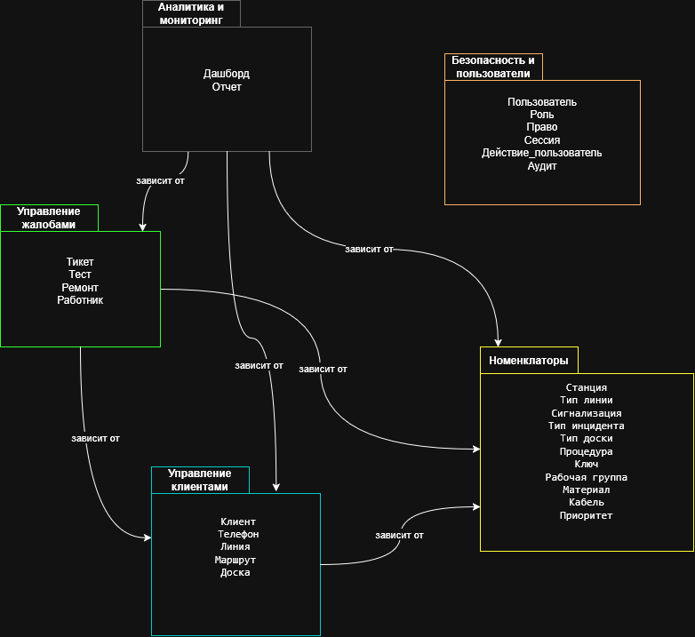

# 6. Диаграмма пакетов

_(Diagrama de Paquetes)_

---

## 6.1. Описание пакетов

_(Descripción de paquetes)_

| Пакет _(Paquete)_               | Описание _(Descripción)_                                                                                                                  | Классы _(Clases)_                                                                                                        |
| ------------------------------- | ----------------------------------------------------------------------------------------------------------------------------------------- | ------------------------------------------------------------------------------------------------------------------------ |
| **Управление клиентами**        | Управление данными клиентов, телефонов, линий, маршрутов, досок _(Gestión de datos de clientes, teléfonos, líneas, recorridos, pizarras)_ | Клиент, Телефон, Линия, Маршрут, Доска                                                                                   |
| **Управление жалобами**         | Управление инцидентами, диагностикой, ремонтами, работниками _(Gestión de incidencias, diagnósticos, reparaciones, trabajadores)_         | Тикет, Тест, Ремонт, Работник                                                                                            |
| **Номенклаторы**                | Общие справочники (Shared Kernel) _(Catálogos comunes - Shared Kernel)_                                                                   | Станция, Тип инцидента, Ключ, Рабочая группа, Кабель, Тип линии, Тип доски, Сигнализация, Процедура, Материал, Приоритет |
| **Безопасность и пользователи** | Аутентификация, авторизация, аудит _(Autenticación, autorización, auditoría)_                                                             | Пользователь, Роль, Право, Сессия, Действие_пользователя, Аудит                                                          |
| **Аналитика и мониторинг**      | Дашборды и отчеты _(Dashboards y reportes)_                                                                                               | Дашборд, Отчет                                                                                                           |

---

## 6.2. Правила зависимостей

_(Reglas de dependencias)_

| Правило _(Regla)_                                                                                         | Описание _(Descripción)_                                                                                      |
| --------------------------------------------------------------------------------------------------------- | ------------------------------------------------------------------------------------------------------------- |
| **Номенклаторы** не должен зависеть от других пакетов                                                     | Shared Kernel — не имеет зависимостей _(Shared Kernel — no tiene dependencias)_                               |
| **Безопасность и пользователи** не должен зависеть от других пакетов                                      | Управление пользователями независимо _(Gestión de usuarios independiente)_                                    |
| **Управление клиентами** может зависеть от **Номенклаторы**                                               | Использует справочники: Тип линии, Кабель, Сигнализация, Тип доски, Станция _(Usa catálogos)_                 |
| **Управление жалобами** может зависеть от **Номенклаторы**                                                | Использует справочники: Тип инцидента, Ключ, Рабочая группа, Приоритет, Процедура, Материал _(Usa catálogos)_ |
| **Управление жалобами** может зависеть от **Управление клиентами**                                        | Тикеты связаны с клиентами и их объектами _(Los tickets se relacionan con clientes y sus objetos)_            |
| **Аналитика и мониторинг** зависит от **Управление клиентами**, **Управление жалобами**, **Номенклаторы** | Отчеты используют данные из всех бизнес-пакетов _(Los reportes usan datos de todos los paquetes de negocio)_  |
| **Запрещены циклические зависимости**                                                                     | Нельзя создавать зависимости, которые образуют цикл _(No se pueden crear dependencias que formen ciclos)_     |

---

## 6.3. Таблица зависимостей

_(Tabla de dependencias)_

| Пакет-источник _(Paquete origen)_ | Зависит от _(Depende de)_ | Причина _(Razón)_                                                                                                                                          |
| --------------------------------- | ------------------------- | ---------------------------------------------------------------------------------------------------------------------------------------------------------- |
| Управление клиентами              | Номенклаторы              | Использует справочники: Тип линии, Кабель, Сигнализация, Тип доски, Станция _(Usa catálogos)_                                                              |
| Управление жалобами               | Номенклаторы              | Использует справочники: Тип инцидента, Ключ, Рабочая группа, Приоритет, Процедура, Материал _(Usa catálogos)_                                              |
| Управление жалобами               | Управление клиентами      | Использует классы: Клиент, Телефон, Линия, Доска, Маршрут _(Usa clases de gestión de clientes)_                                                            |
| Аналитика и мониторинг            | Управление клиентами      | Для получения данных о клиентах, телефонах, линиях, маршрутах, досках _(Para obtener datos de clientes, teléfonos, líneas, recorridos, pizarras)_          |
| Аналитика и мониторинг            | Управление жалобами       | Для получения данных о тикетах, тестах, ремонтах, работниках _(Para obtener datos de tickets, tests, reparaciones, trabajadores)_                          |
| Аналитика и мониторинг            | Номенклаторы              | Для получения данных о каталогах (использование материалов, процедур и т.д.) _(Para obtener datos de catálogos - uso de materiales, procedimientos, etc.)_ |
| **Номенклаторы**                  | **Нет зависимостей**      | Shared Kernel — не зависит от других пакетов _(Shared Kernel — no depende de otros paquetes)_                                                              |
| **Безопасность и пользователи**   | **Нет зависимостей**      | Управление пользователями независимо, не используется для аналитики _(Gestión de usuarios independiente, no se usa para analítica)_                        |

---

## 6.4. Диаграмма пакетов



## 6.5. Правила запрета циклических зависимостей

(Reglas de prohibición de dependencias cíclicas)

```text
НЕЛЬЗЯ: Управление клиентами → Управление жалобами → Управление клиентами
НЕЛЬЗЯ: Номенклаторы → любой другой пакет (Shared Kernel НЕ должен зависеть от других)
НЕЛЬЗЯ: Безопасность и пользователи → любой другой пакет
НЕЛЬЗЯ: Образование циклов между пакетами
```
