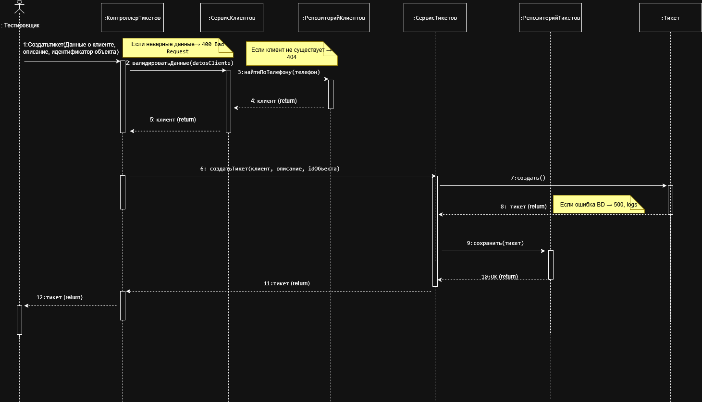
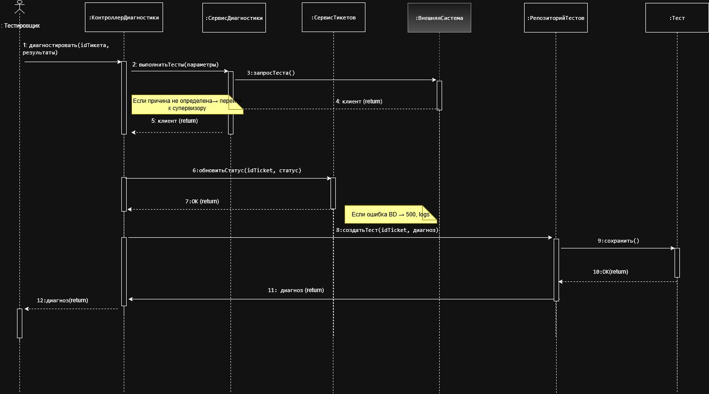
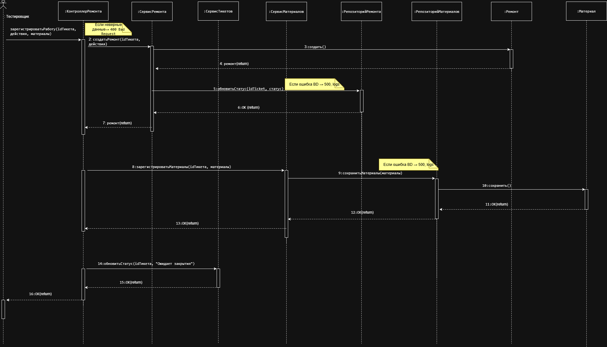

# 8. Сценарии и взаимодействия

_(Escenarios e interacciones)_

---

## 8.1. Введение

_(Introducción)_

В данной практической работе моделируются взаимодействия объектов в рамках ключевых сценариев системы. Диаграммы последовательности показывают, кто с кем взаимодействует, какие объекты несут ответственность за выполнение шагов сценария, и где возникают ошибки.

_(En este trabajo práctico se modelan las interacciones de los objetos en el marco de los escenarios clave del sistema. Los diagramas de secuencia muestran quién interactúa con quién, qué objetos son responsables de los pasos del escenario y dónde ocurren los errores.)_

---

## 8.2. Выбранные сценарии

_(Escenarios seleccionados)_

| №   | Сценарий _(Escenario)_                                                                           | Прецедент _(Caso de uso)_                      | Актор _(Actor)_ |
| --- | ------------------------------------------------------------------------------------------------ | ---------------------------------------------- | --------------- |
| 1   | Регистрация инцидента _(Registro de incidencia)_                                                 | Создать тикет                                  | Тестировщик     |
| 2   | Диагностика инцидента _(Diagnóstico de incidencia)_                                              | Диагностировать инцидент                       | Тестировщик     |
| 3   | Регистрация полевых работ и закрытие тикета _(Registro de trabajos de campo y cierre de ticket)_ | Зарегистрировать полевые работы, Закрыть тикет | Тестировщик     |

---

## 8.3. Сценарий 1: Регистрация инцидента

_(Escenario 1: Registro de incidencia)_

### 8.3.1. Описание сценария

_(Descripción del escenario)_

| Элемент                  | Описание _(Descripción)_                                                                                                                                               |
| ------------------------ | ---------------------------------------------------------------------------------------------------------------------------------------------------------------------- |
| **Название**             | Регистрация инцидента _(Registro de incidencia)_                                                                                                                       |
| **Актор**                | Тестировщик _(Tester)_                                                                                                                                                 |
| **Прецедент**            | Создать тикет                                                                                                                                                          |
| **Предусловие**          | Клиент звонит с сообщением о неисправности. Тестировщик аутентифицирован в системе _(El cliente llama reportando una falla. El tester está autenticado en el sistema)_ |
| **Постусловие**          | Создан новый тикет в статусе «Новый» _(Se ha creado un nuevo ticket en estado "Nuevo")_                                                                                |
| **Альтернативный поток** | Если клиент не существует, выполняется регистрация клиента (расширение) _(Si el cliente no existe, se registra primero)_                                               |

---

### 8.3.2. Участники

_(Participantes)_

| Участник               | Тип         | Ответственность _(Responsabilidad)_                                                  |
| ---------------------- | ----------- | ------------------------------------------------------------------------------------ |
| `:Тестировщик`         | Actor       | Инициирует взаимодействие, вводит данные _(Inicia la interacción, ingresa datos)_    |
| `:КонтроллерТикетов`   | Контроллер  | Принимает запрос, валидирует, оркестрирует _(Recibe la solicitud, valida, orquesta)_ |
| `:СервисКлиентов`      | Сервис      | Логика работы с клиентами _(Lógica de negocio para clientes)_                        |
| `:СервисТикетов`       | Сервис      | Логика работы с тикетами _(Lógica de negocio para tickets)_                          |
| `:РепозиторийКлиентов` | Репозиторий | Доступ к данным клиентов _(Acceso a datos de clientes)_                              |
| `:РепозиторийТикетов`  | Репозиторий | Доступ к данным тикетов _(Acceso a datos de tickets)_                                |
| `:Клиент`              | Сущность    | Данные клиента _(Datos del cliente)_                                                 |
| `:Тикет`               | Сущность    | Данные тикета _(Datos del ticket)_                                                   |

---

### 8.3.3. Диаграмма последовательности

_(Диаграмма последовательности)_

---

### 8.3.4. Таблица сообщений

_(Tabla de mensajes)_

| №   | Сообщение _(Mensaje)_ | Отправитель _(Origen)_ | Получатель _(Destino)_ | Входные данные _(Entrada)_          | Выходные данные _(Salida)_ | Ошибки _(Errores)_ |
| --- | --------------------- | ---------------------- | ---------------------- | ----------------------------------- | -------------------------- | ------------------ |
| 1   | crearTicket()         | Тестировщик            | КонтроллерТикетов      | datosCliente, descripcion, idObjeto | -                          | 400, 401           |
| 2   | валидироватьДанные()  | КонтроллерТикетов      | СервисКлиентов         | datosCliente                        | boolean                    | -                  |
| 3   | найтиПоТелефону()     | СервисКлиентов         | РепозиторийКлиентов    | телефон                             | Клиент или null            | -                  |
| 4   | создатьТикет()        | КонтроллерТикетов      | СервисТикетов          | клиент, описание, idОбъекта         | Тикет                      | -                  |
| 5   | создать()             | СервисТикетов          | Тикет                  | клиент, описание, idОбъекта         | Тикет                      | -                  |
| 6   | сохранить()           | СервисТикетов          | РепозиторийТикетов     | Тикет                               | -                          | 500                |

---

### 8.3.5. Границы атомарных операций

_(Límites de operaciones atómicas)_

| Операция _(Operación)_   | Атомарность _(Atomicidad)_ | Причина _(Razón)_                                                                     |
| ------------------------ | -------------------------- | ------------------------------------------------------------------------------------- |
| Создание тикета          | Должна быть атомарной      | Тикет не должен быть создан без сохранения в БД _(No debe crearse sin guardar en BD)_ |
| Сохранение в репозитории | Входит в транзакцию        | Обеспечивает целостность данных _(Garantiza integridad de datos)_                     |

---

### 8.3.6. Обработка ошибок

_(Manejo de errores)_

| Ошибка _(Error)_                                      | Код | Действие системы _(Acción del sistema)_                                                                           |
| ----------------------------------------------------- | --- | ----------------------------------------------------------------------------------------------------------------- |
| Неверные данные _(Datos inválidos)_                   | 400 | Возвращает сообщение об ошибке валидации _(Retorna mensaje de error de validación)_                               |
| Клиент не аутентифицирован _(Cliente no autenticado)_ | 401 | Перенаправляет на страницу входа _(Redirige a página de login)_                                                   |
| Клиент не найден _(Cliente no encontrado)_            | 404 | Предлагает зарегистрировать нового клиента _(Sugiere registrar nuevo cliente)_                                    |
| Ошибка базы данных _(Error de base de datos)_         | 500 | Логирует ошибку, возвращает сообщение о технической проблеме _(Logea error, retorna mensaje de problema técnico)_ |

---

## 8.4. Сценарий 2: Диагностика инцидента

_(Escenario 2: Diagnóstico de incidencia)_

### 8.4.1. Описание сценария

_(Descripción del escenario)_

| Элемент            | Описание _(Descripción)_                                                                                                                                    |
| ------------------ | ----------------------------------------------------------------------------------------------------------------------------------------------------------- |
| **Название**       | Диагностика инцидента _(Diagnóstico de incidencia)_                                                                                                         |
| **Актор**          | Тестировщик _(Tester)_                                                                                                                                      |
| **Прецедент**      | Диагностировать инцидент, Выполнить тесты                                                                                                                   |
| **Предусловие**    | Тикет создан и находится в статусе «Открыто» _(Ticket creado en estado "Abierto")_                                                                          |
| **Постусловие**    | Диагноз зарегистрирован, определено: требуется ремонт или быстрое решение _(Diagnóstico registrado, determinado: requiere reparación o solución inmediata)_ |
| **Бизнес-правила** | БП-001: Диагностика должна быть завершена максимум за 10 минут _(Máximo 10 minutos)_                                                                        |

---

### 8.4.2. Участники

_(Participantes)_

| Участник                 | Тип         | Ответственность _(Responsabilidad)_                                                  |
| ------------------------ | ----------- | ------------------------------------------------------------------------------------ |
| `:Тестировщик`           | Actor       | Инициирует диагностику, вводит результаты _(Inicia diagnóstico, ingresa resultados)_ |
| `:КонтроллерДиагностики` | Контроллер  | Принимает результаты, оркестрирует _(Recibe resultados, orquesta)_                   |
| `:СервисДиагностики`     | Сервис      | Логика диагностики _(Lógica de diagnóstico)_                                         |
| `:СервисТикетов`         | Сервис      | Обновление статуса тикета _(Actualización de estado del ticket)_                     |
| `:ВнешняяСистема`        | Интеграция  | Выполняет технические тесты _(Ejecuta pruebas técnicas)_                             |
| `:РепозиторийТестов`     | Репозиторий | Сохраняет результаты тестов _(Guarda resultados de pruebas)_                         |
| `:Тикет`                 | Сущность    | Данные тикета _(Datos del ticket)_                                                   |
| `:Тест`                  | Сущность    | Результаты диагностики _(Resultados del diagnóstico)_                                |
| `:Ключ`                  | Номенклатор | Код результата _(Código de resultado)_                                               |

---

### 8.4.3. Диаграмма последовательности

_(Диаграмма последовательности)_

---

### 8.4.4. Таблица сообщений

_(Tabla de mensajes)_

| №   | Сообщение _(Mensaje)_ | Отправитель _(Origen)_ | Получатель _(Destino)_ | Входные данные _(Entrada)_ | Выходные данные _(Salida)_ | Ошибки _(Errores)_ |
| --- | --------------------- | ---------------------- | ---------------------- | -------------------------- | -------------------------- | ------------------ |
| 1   | diagnosticar()        | Тестировщик            | КонтроллерДиагностики  | idTicket, resultados       | диагноз                    | 400, 401, 404      |
| 2   | выполнитьТесты()      | КонтроллерДиагностики  | СервисДиагностики      | параметры                  | диагноз                    | -                  |
| 3   | запросТеста()         | СервисДиагностики      | ВнешняяСистема         | параметры                  | resultados                 | 503 (таймаут)      |
| 4   | обновитьСтатус()      | КонтроллерДиагностики  | СервисТикетов          | idTicket, статус           | OK                         | -                  |
| 5   | создатьТест()         | СервисДиагностики      | РепозиторийТестов      | idTicket, диагноз          | Тест                       | -                  |
| 6   | сохранить()           | РепозиторийТестов      | Тест                   | данные теста               | -                          | 500                |

---

### 8.4.5. Границы атомарных операций

_(Límites de operaciones atómicas)_

| Операция _(Operación)_         | Атомарность _(Atomicidad)_ | Причина _(Razón)_                                                                                                                |
| ------------------------------ | -------------------------- | -------------------------------------------------------------------------------------------------------------------------------- |
| Выполнение тестов и сохранение | Должна быть атомарной      | Диагноз должен сохраняться только после успешного выполнения тестов _(El diagnóstico debe guardarse solo tras pruebas exitosas)_ |
| Обновление статуса тикета      | Входит в транзакцию        | Статус тикета должен соответствовать результату диагностики _(El estado debe coincidir con el diagnóstico)_                      |

---

### 8.4.6. Обработка ошибок

_(Manejo de errores)_

| Ошибка _(Error)_                                    | Код | Действие системы _(Acción del sistema)_                                                                     |
| --------------------------------------------------- | --- | ----------------------------------------------------------------------------------------------------------- |
| Таймаут внешней системы _(Timeout sistema externo)_ | 503 | Повторный запрос до 3 раз, затем эскалация _(Reintento hasta 3 veces, luego escalación)_                    |
| Неверные результаты тестов _(Resultados inválidos)_ | 400 | Запрос повторного ввода _(Solicitar nueva entrada)_                                                         |
| Тикет не найден _(Ticket no encontrado)_            | 404 | Сообщение об ошибке _(Mensaje de error)_                                                                    |
| Превышение времени диагностики (10 мин)             | -   | Фиксация предупреждения для метрик, продолжение работы _(Registro de advertencia para métricas, continuar)_ |

---

## 8.5. Сценарий 3: Регистрация полевых работ и закрытие тикета

_(Escenario 3: Registro de trabajos de campo y cierre de ticket)_

### 8.5.1. Описание сценария

_(Descripción del escenario)_

| Элемент            | Описание _(Descripción)_                                                                                                                                   |
| ------------------ | ---------------------------------------------------------------------------------------------------------------------------------------------------------- |
| **Название**       | Регистрация полевых работ и закрытие тикета _(Registro de trabajos de campo y cierre de ticket)_                                                           |
| **Актор**          | Тестировщик _(Tester)_                                                                                                                                     |
| **Прецеденты**     | Зарегистрировать полевые работы, Закрыть тикет                                                                                                             |
| **Предусловие**    | Тикет в статусе «Ремонт назначен». Техник сообщил о выполненных работах _(Ticket en estado "Reparación asignada". El técnico reportó trabajos realizados)_ |
| **Постусловие**    | Тикет закрыт, материалы зарегистрированы, время решения зафиксировано _(Ticket cerrado, materiales registrados, tiempo de solución registrado)_            |
| **Бизнес-правила** | БП-005: Нельзя закрыть тикет без регистрации использованных материалов _(No se puede cerrar sin registrar materiales)_                                     |

---

### 8.5.2. Участники

_(Participantes)_

| Участник                 | Тип         | Ответственность _(Responsabilidad)_                                            |
| ------------------------ | ----------- | ------------------------------------------------------------------------------ |
| `:Тестировщик`           | Actor       | Инициирует регистрацию работ, закрытие _(Inicia registro de trabajos, cierre)_ |
| `:КонтроллерРемонта`     | Контроллер  | Принимает данные работ, оркестрирует _(Recibe datos de trabajos, orquesta)_    |
| `:СервисРемонта`         | Сервис      | Логика регистрации работ _(Lógica de registro de trabajos)_                    |
| `:СервисТикетов`         | Сервис      | Обновление статуса, закрытие _(Actualización de estado, cierre)_               |
| `:СервисМатериалов`      | Сервис      | Регистрация материалов _(Registro de materiales)_                              |
| `:РепозиторийРемонта`    | Репозиторий | Сохраняет данные ремонта _(Guarda datos de reparación)_                        |
| `:РепозиторийМатериалов` | Репозиторий | Сохраняет данные материалов _(Guarda datos de materiales)_                     |
| `:Тикет`                 | Сущность    | Данные тикета _(Datos del ticket)_                                             |
| `:Ремонт`                | Сущность    | Данные ремонта _(Datos de reparación)_                                         |
| `:Материал`              | Сущность    | Данные материалов _(Datos de materiales)_                                      |
| `:Ключ`                  | Номенклатор | Код статуса _(Código de estado)_                                               |

---

### 8.5.3. Диаграмма последовательности

_(Диаграмма последовательности)_

---

### 8.5.4. Таблица сообщений

_(Tabla de mensajes)_

| №   | Сообщение _(Mensaje)_ | Отправитель _(Origen)_ | Получатель _(Destino)_ | Входные данные _(Entrada)_     | Выходные данные _(Salida)_ | Ошибки _(Errores)_ |
| --- | --------------------- | ---------------------- | ---------------------- | ------------------------------ | -------------------------- | ------------------ |
| 1   | registrarTrabajo()    | Тестировщик            | КонтроллерРемонта      | idTicket, acciones, materiales | OK                         | 400, 401, 404      |
| 2   | crearRemont()         | КонтроллерРемонта      | СервисРемонта          | idTicket, acciones             | Ремонт                     | -                  |
| 3   | создать()             | СервисРемонта          | Ремонт                 | idTicket, acciones             | Ремонт                     | -                  |
| 4   | registrarMateriales() | КонтроллерРемонта      | СервисМатериалов       | idTicket, materiales           | OK                         | -                  |
| 5   | сохранить()           | СервисМатериалов       | Материал               | idTicket, materiales           | -                          | 500                |
| 6   | обновитьСтатус()      | КонтроллерРемонта      | СервисТикетов          | idTicket, статус               | OK                         | -                  |

---

### 8.5.5. Границы атомарных операций

_(Límites de operaciones atómicas)_

| Операция _(Operación)_    | Атомарность _(Atomicidad)_ | Причина _(Razón)_                                                                         |
| ------------------------- | -------------------------- | ----------------------------------------------------------------------------------------- |
| Регистрация ремонта       | Должна быть атомарной      | Ремонт не должен создаваться без сохранения _(No debe crearse sin guardar)_               |
| Регистрация материалов    | Должна быть атомарной      | Материалы должны регистрироваться все вместе _(Materiales deben registrarse juntos)_      |
| Обновление статуса тикета | Входит в транзакцию        | Статус должен соответствовать завершению работ _(Estado debe coincidir con finalización)_ |

---

### 8.5.6. Обработка ошибок

_(Manejo de errores)_

| Ошибка _(Error)_                                          | Код | Действие системы _(Acción del sistema)_                                                  |
| --------------------------------------------------------- | --- | ---------------------------------------------------------------------------------------- |
| Не указаны материалы _(Materiales no especificados)_      | 400 | Блокирует закрытие, требует регистрации материалов _(Bloquea cierre, requiere registro)_ |
| Неверные данные ремонта _(Datos de reparación inválidos)_ | 400 | Запрос повторного ввода _(Solicitar nueva entrada)_                                      |
| Тикет не найден _(Ticket no encontrado)_                  | 404 | Сообщение об ошибке _(Mensaje de error)_                                                 |
| Ошибка базы данных _(Error de base de datos)_             | 500 | Откат транзакции, логирование _(Rollback de transacción, logging)_                       |

---

## 8.6. Требования к наблюдаемости

_(Requisitos de observabilidad)_

| Событие _(Evento)_                                | Логируется _(Se loguea)_                                                         | Метрики _(Métricas)_                                                    |
| ------------------------------------------------- | -------------------------------------------------------------------------------- | ----------------------------------------------------------------------- |
| Создание тикета _(Creación de ticket)_            | ID тикета, ID клиента, время _(ID ticket, ID cliente, hora)_                     | Количество созданных тикетов _(Cantidad de tickets creados)_            |
| Диагностика _(Diagnóstico)_                       | ID тикета, результаты, время _(ID ticket, resultados, hora)_                     | Время диагностики, % ремонтов _(Tiempo de diagnóstico, % reparaciones)_ |
| Регистрация материалов _(Registro de materiales)_ | ID тикета, список материалов _(ID ticket, lista de materiales)_                  | Использование материалов _(Uso de materiales)_                          |
| Закрытие тикета _(Cierre de ticket)_              | ID тикета, время решения, кто закрыл _(ID ticket, tiempo solución, quién cerró)_ | Время решения, соблюдение SLA _(Tiempo solución, cumplimiento SLA)_     |
| Ошибки _(Errores)_                                | Тип ошибки, сообщение, время _(Tipo error, mensaje, hora)_                       | Частота ошибок _(Frecuencia de errores)_                                |

**Корреляционный идентификатор** _(ID de correlación)_: `X-Request-ID` передается через все вызовы для сквозной диагностики.

---

## 8.7. Связь с API

_(Relación con API)_

Диаграммы последовательности напрямую соответствуют API-эндпоинтам:

| Сценарий _(Escenario)_    | Эндпоинт _(Endpoint)_             | Метод _(Método)_ |
| ------------------------- | --------------------------------- | ---------------- |
| Регистрация инцидента     | `/api/v1/tickets`                 | POST             |
| Диагностика инцидента     | `/api/v1/tickets/{id}/diagnostic` | POST             |
| Регистрация полевых работ | `/api/v1/tickets/{id}/repairs`    | POST             |
| Регистрация материалов    | `/api/v1/tickets/{id}/materials`  | POST             |
| Закрытие тикета           | `/api/v1/tickets/{id}/close`      | PUT              |

Каждый контроллер на диаграмме соответствует одному или группе эндпоинтов.

---

## 8.8. Заключение

_(Conclusión)_

В данной практической работе:

- Выбраны 3 критических сценария системы
- Построены диаграммы последовательности, показывающие взаимодействие объектов
- Определены участники и их ответственность
- Составлены таблицы сообщений с контрактами
- Выделены границы атомарных операций
- Описана обработка ошибок
- Определены требования к наблюдаемости

Диаграммы последовательности служат основой для проектирования API, определения границ транзакций и реализации бизнес-логики.

_(En este trabajo práctico:_

- _Se seleccionaron 3 escenarios críticos del sistema_
- _Se construyeron diagramas de secuencia que muestran la interacción de objetos_
- _Se definieron los participantes y sus responsabilidades_
- _Se elaboraron tablas de mensajes con contratos_
- _Se identificaron los límites de operaciones atómicas_
- _Se describió el manejo de errores_
- _Se definieron los requisitos de observabilidad_

_Los diagramas de secuencia sirven como base para el diseño de API, la definición de límites de transacciones y la implementación de la lógica de negocio.)_
