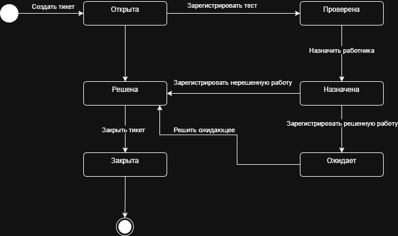

# 9. Диаграмма состояний
_(Diagrama de Estados)_

---

## 9.1. Введение
_(Introducción)_

В данной практической работе моделируется жизненный цикл ключевой сущности системы — **Тикет (Queja)**. Диаграмма состояний формализует допустимые переходы, события, условия и запреты. Результат позволяет однозначно ответить на вопросы: в каком состоянии может находиться сущность, какие события меняют состояние, кто имеет право инициировать переход, какие данные обязательны и какие проверки выполняются.

_(En este trabajo práctico se modela el ciclo de vida de la entidad clave del sistema — **Тикет (Ticket)**. El diagrama de estados formaliza las transiciones permitidas, eventos, condiciones y prohibiciones. El resultado permite responder inequívocamente: en qué estado puede estar la entidad, qué eventos cambian el estado, quién tiene derecho a iniciar la transición, qué datos son obligatorios y qué validaciones se realizan.)_

---

## 9.2. Выбор сущности для моделирования
_(Selección de la entidad para modelar)_

| Сущность _(Entidad)_ | Причина выбора _(Razón de selección)_                                       |
| -------------------- | --------------------------------------------------------------------------- |
| **Тикет (Queja)**    | Центральная сущность системы. Имеет сложный жизненный цикл с 6 состояниями. |

_(**Тикет (Ticket)** — Entidad central del sistema. Tiene un ciclo de vida complejo con 6 estados. Sin un modelo formal son posibles errores: cierre sin diagnóstico, pérdida de estados intermedios, transiciones incorrectas.)_

---

## 9.3. Состояния тикета
_(Estados del ticket)_

| #   | Состояние     | Описание _(Descripción)_                                                                                                                          | Терминальное _(Terminal)_ |
| --- | ------------- | ------------------------------------------------------------------------------------------------------------------------------------------------- | ------------------------- |
| 1   | **Открыта**   | Тикет создан, ожидает регистрации теста _(Ticket creado, esperando registro de prueba)_                                                           |                           |
| 2   | **Проверена** | Тест зарегистрирован, результат требует назначения работника _(Prueba registrada, resultado requiere asignación de trabajador)_                   |                           |
| 3   | **Назначена** | Работник назначен на ремонт _(Trabajador asignado para reparación)_                                                                               |                           |
| 4   | **Ожидает**   | Работа зарегистрирована с ключом "Ожидает" (ожидание материалов и т.д.) _(Trabajo registrado con clave "pendiente" - espera de materiales, etc.)_ |                           |
| 5   | **Решена**    | Проблема решена, ожидает закрытия _(Problema resuelto, espera cierre)_                                                                            |                           |
| 6   | **Закрыта**   | Тикет завершен _(Ticket finalizado)_                                                                                                              |                           |

---

## 9.4. События и источники событий
_(Eventos y fuentes de eventos)_

| #   | Событие (ES)                  | Событие (RU)                           | Откуда _(Desde)_ | Куда _(Hasta)_ | Условие _(Condición)_                                   | Инициатор _(Iniciador)_ | Роль _(Rol)_ |
| --- | ----------------------------- | -------------------------------------- | ---------------- | -------------- | ------------------------------------------------------- | ----------------------- | ------------ |
| 1   | Crear ticket                  | **Создать тикет**                      | -                | Открыта        | -                                                       | Тестировщик             | Tester       |
| 2   | Registrar prueba (exitosa)    | **Зарегистрировать тест (успешно)**    | Открыта          | Решена         | clavePendiente = false                                  | Тестировщик             | Tester       |
| 3   | Registrar prueba (no exitosa) | **Зарегистрировать тест (не успешно)** | Открыта          | Проверена      | clavePendiente = true                                   | Тестировщик             | Tester       |
| 4   | Asignar trabajador            | **Назначить работника**                | Проверена        | Назначена      | -                                                       | Супервизор              | Supervisor   |
| 5   | Registrar trabajo (exitoso)   | **Зарегистрировать работу (успешно)**  | Назначена        | Решена         | clavePendiente = false                                  | Тестировщик             | Tester       |
| 6   | Registrar trabajo (pendiente) | **Зарегистрировать работу (ожидание)** | Назначена        | Ожидает        | clavePendiente = true                                   | Тестировщик             | Tester       |
| 7   | Resolver pendiente            | **Решить ожидающее**                   | Ожидает          | Решена         | Причина ожидания устранена _(Causa de espera resuelta)_ | Тестировщик             | Tester       |
| 8   | Cerrar ticket                 | **Закрыть тикет**                      | Решена           | Закрыта        | -                                                       | Тестировщик             | Tester       |

*clavePendiente: Ключ, указывающий текущее состояние тикета* 
---

## 9.5. Диаграмма состояний
_(Diagrama de estados)_

## 9.6. Инварианты и обязательные данные по состояниям
_(Invariantes y datos obligatorios por estado)_

### 9.6.1. Инварианты
_(Invariantes)_

| ID      | Инвариант _(Invariante)_                                                                                                                        | Где контролируется _(Controlado en)_ |
| ------- | ----------------------------------------------------------------------------------------------------------------------------------------------- | ------------------------------------ |
| INV-001 | Нельзя закрыть тикет без решения проблемы _(No se puede cerrar el ticket sin resolver el problema)_                                             | Приложение + БД _(Aplicación + BD)_  |
| INV-002 | Нельзя перейти в состояние "Решена" без зарегистрированного теста или работы _(No se puede pasar a "Resuelta" sin prueba o trabajo registrado)_ | Приложение _(Aplicación)_            |
| INV-003 | Нельзя назначить работника без проведения теста _(No se puede asignar trabajador sin realizar prueba)_                                          | Приложение _(Aplicación)_            |

### 9.6.2. Обязательные данные по состояниям
_(Datos obligatorios por estado)_

| Состояние _(Estado)_ | Обязательные данные _(Datos obligatorios)_                              | Запрещенные данные _(Datos prohibidos)_ |
| -------------------- | ----------------------------------------------------------------------- | --------------------------------------- |
| Открыта              | id_клиента, описание                                                    | id_теста, id_работы, id_работника       |
| Проверена            | id_клиента, описание, id_теста, результат_теста                         | id_работы, id_работника                 |
| Назначена            | id_клиента, описание, id_теста, результат_теста, id_работника           | id_работы                               |
| Ожидает              | id_клиента, описание, id_теста, id_работника, id_работы, ключ_pendiente | -                                       |
| Решена               | id_клиента, описание, id_теста или id_работы, решение                   | -                                       |
| Закрыта              | Все данные заполнены, время_закрытия                                    | -                                       |

---

## 9.7. Правила прав доступа и аудит переходов
_(Reglas de acceso y auditoría de transiciones)_

| Переход _(Transición)_         | Разрешенная роль _(Rol permitido)_ | Аудировать? _(¿Auditar?)_ |
| ------------------------------ | ---------------------------------- | ------------------------- |
| → Открыта                      | Тестировщик                        | Да                        |
| Открыта → Решена (по тесту)    | Тестировщик                        | Да                        |
| Открыта → Проверена            | Тестировщик                        | Да                        |
| Проверена → Назначена          | Супервизор                         | Да                        |
| Назначена → Решена (по работе) | Тестировщик                        | Да                        |
| Назначена → Ожидает            | Тестировщик                        | Да                        |
| Ожидает → Решена               | Тестировщик                        | Да                        |
| Решена → Закрыта               | Тестировщик                        | Да                        |

9.10. Набор тест кейсов

(Conjunto de test cases)
9.10.1. Тест кейсы для тикета

(Test cases para ticket)
| ID    | Название (Nombre)            | Начальное состояние (Estado inicial) | Событие (Evento)                                                   | Данные (Datos)       | Ожидаемое состояние (Estado esperado) | Ошибка? | Код |
| :---- | :--------------------------- | :----------------------------------- | :----------------------------------------------------------------- | :------------------- | :------------------------------------ | :------ | :-- |
| TC-01 | Создать тикет                | -                                    | Создать тикет                                                      | id_клиента, описание | Открыта                               | Нет     | 201 |
| TC-02 | Создать тикет без клиента    | -                                    | Создать тикет                                                      | описание             | -                                     | Да      | 400 |
| TC-03 | Тест успешный → Решена       | Открыта                              | Зарегистрировать тест                                              | clavePendiente=false | Решена                                | Нет     | 200 |
| TC-04 | Тест не успешный → Проверена | Открыта                              | Зарегистрировать тест                                              | clavePendiente=true  | Проверена                             | Нет     | 200 |
| TC-05 | Назначить работника          | Проверена                            | Назначить работника                                                | id_работника         | Назначена                             | Нет     | 200 |
| TC-06 | Назначить без прав           | Проверена                            | Назначить работника                                                | id_работника         | -                                     | Да      | 403 |
| TC-07 | Работа успешная → Решена     | Назначена                            | Зарегистрировать работу                                            | clavePendiente=false | Решена                                | Нет     | 200 |
| TC-08 | Работа pendiente → Ожидает   | Назначена                            | Зарегистрировать работу                                            | clavePendiente=true  | Ожидает                               | Нет     | 200 |
| TC-09 | Работа без действий          | Назначена                            | Зарегистрировать работу                                            | -                    | -                                     | Да      | 400 |
| TC-10 | Решить ожидающее             | Ожидает                              | Решить ожидающее                                                   | решение              | Решена                                | Нет     | 200 |
| TC-11 | Закрыть тикет                | Решена                               | Закрыть тикет                                                      | время_закрытия       | Закрыта                               | Нет     | 200 |
| TC-12 | Закрыть без решения          | Открыта                              | Закрыть тикет                                                      | -                    | -                                     | Да      | 400 |
| TC-13 | Закрыть из Проверена         | Проверена                            | Закрыть тикет                                                      | -                    | -                                     | Да      | 400 |
| TC-14 | Закрыть из Ожидает           | Ожидает                              | Закрыть тикет                                                      | -                    | -                                     | Да      | 400 |
| TC-15 | Конфликт версий              | Решена (v1)                          | Закрыть тикет (v1)                                                 | -                    | -                                     | Да      | 409 |
| TC-16 | Полный цикл (тест успешен)   | Открыта                              | Создать→Тест успешный→Закрыть                                      | -                    | Закрыта                               | Нет     | 200 |
| TC-17 | Полный цикл (с ремонтом)     | Открыта                              | Создать→Тест не успешный→Назначить→Работа успешная→Закрыть         | -                    | Закрыта                               | Нет     | 200 |
| TC-18 | Полный цикл с ожиданием      | Открыта                              | Создать→Тест не успешный→Назначить→Работа pendiente→Решить→Закрыть | -                    | Закрыта                               | Нет     | 200 |