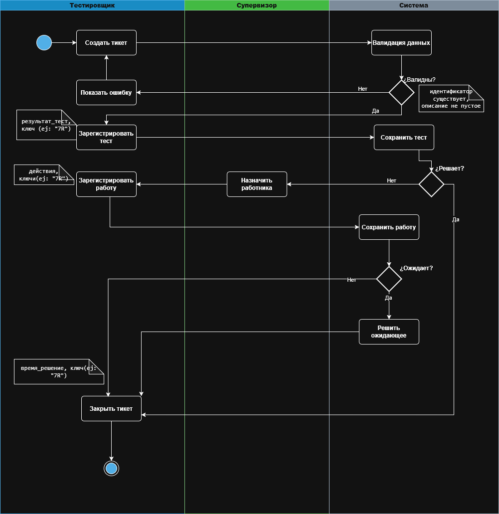
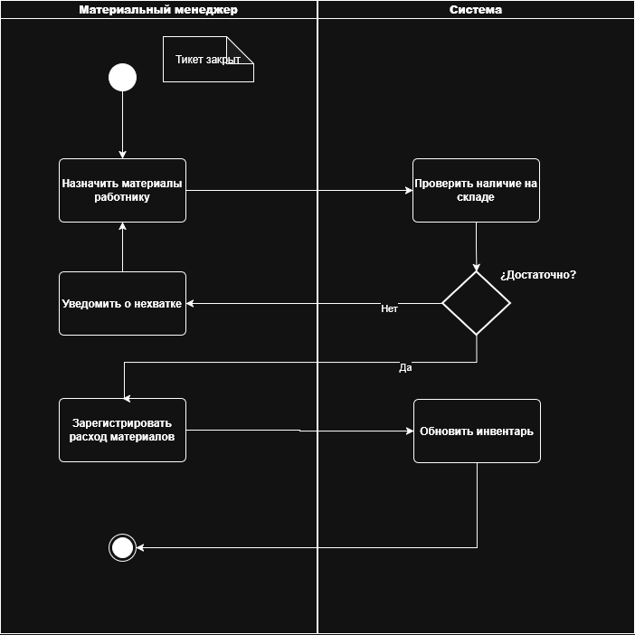

# 10. Диаграммы деятельности
_(Diagramas de Actividad)_

---

## 10.1. Введение
_(Introducción)_

В данной практической работе моделируются процессы корпоративной системы как последовательность действий с распределением ответственности между ролями. Диаграммы деятельности формально описывают регламент работы, включая ветвления, параллельные действия, ожидание внешних событий, ручные операции и автоматизированные шаги.

_(En este trabajo práctico se modelan los procesos del sistema corporativo como una secuencia de acciones con distribución de responsabilidades entre roles. Los diagramas de actividad describen formalmente el reglamento de trabajo, incluyendo ramificaciones, acciones paralelas, espera de eventos externos, operaciones manuales y pasos automatizados.)_

---

## 10.2. Выбор процессов для моделирования
_(Selección de procesos para modelar)_

| #   | Процесс                          | Границы процесса                                            | Критерий успеха                                 |
| --- | -------------------------------- | ----------------------------------------------------------- | ----------------------------------------------- |
| 1   | **Полный цикл обработки тикета** | Начало: создание тикета. Конец: тикет закрыт                | Тикет закрыт с зарегистрированным решением      |
| 2   | **Управление материалами**       | Начало: тикет уже закрыт. Конец: материалы зарегистрированы | Материалы зарегистрированы и инвентарь обновлен |

**Важность для бизнеса** _(Importancia para el negocio)_:
- Сокращение времени диагностики (цель: < 10 мин)
- Сокращение времени ремонта (цель: согласно приоритету)
- Контроль запасов материалов
- Полная прослеживаемость каждого тикета

---

## 10.3. Роли и дорожки ответственности
_(Roles y carriles de responsabilidad)_

| Роль (RU)                 | Ответственность                                                         | Человек или Система? |
| ------------------------- | ----------------------------------------------------------------------- | -------------------- |
| **Тестировщик**           | Создание тикета, регистрация тестов, регистрация работ, закрытие тикета | Человек              |
| **Супервизор**            | Назначение работника на тикет                                           | Человек              |
| **Материальный менеджер** | Назначение материалов, регистрация расхода                              | Человек              |
| **Система**               | Валидации, уведомления, аудит, таймеры                                  | Система              |

---

## 10.4. Процесс 1: Полный цикл обработки тикета

 

---

## 10.5. Процесс 2: Управление материалами

---

## 10.6. Данные на шагах процесса
_(Datos en los pasos del proceso)_

### 10.6.1. Процесс 1 - Полный цикл тикета

| Шаг | Действие                | Входные данные                       | Выходные данные | Создается/Изменяется                      |
| --- | ----------------------- | ------------------------------------ | --------------- | ----------------------------------------- |
| 1   | Создать тикет           | id_клиента, описание                 | id_тикета       | Тикет (создан)                            |
| 2   | Валидация данных        | id_клиента, описание                 | -               | -                                         |
| 3   | Зарегистрировать тест   | id_тикета, результат_теста, **ключ** | id_теста        | Тест (создан), Тикет (статус обновлен)    |
| 4   | Назначить работника     | id_тикета, id_работника              | -               | Тикет (статус = Назначена)                |
| 5   | Зарегистрировать работу | id_тикета, действия, **ключ**        | id_работы       | Работа (создана), Тикет (статус обновлен) |
| 6   | Решить ожидающее        | id_тикета, решение, **ключ**         | -               | Тикет (статус = Решена)                   |
| 7   | Закрыть тикет           | id_тикета, время_решения, **ключ**   | -               | Тикет (статус = Закрыта)                  |

### 10.6.2. Процесс 2 - Управление материалами

| Шаг | Действие                | Входные данные                              | Выходные данные | Создается/Изменяется                  |
| --- | ----------------------- | ------------------------------------------- | --------------- | ------------------------------------- |
| 1   | Назначить материалы     | id_работника, список_материалов, количества | -               | Назначение материалов                 |
| 2   | Зарегистрировать расход | id_работы, материалы, количества, **ключ**  | id_расхода      | Расход (создан), Инвентарь (обновлен) |

---

## 10.7. Метрики процесса и точки контроля
_(Métricas del proceso y puntos de control)_

| Метрика (ES)         | Метрика (RU)           | Цель                | Превышение вызывает                   |
| -------------------- | ---------------------- | ------------------- | ------------------------------------- |
| Время диагностики    | Tiempo de diagnóstico  | < 10 мин            | > 10 мин → уведомление супервизора    |
| Время назначения     | Tiempo de asignación   | < 30 мин            | > 30 мин → уведомление администратора |
| Время ремонта        | Tiempo de reparación   | Согласно приоритету | > время по SLA → уведомление          |
| Общее время закрытия | Tiempo total de cierre | < 72 часа           | > 72 часа → эскалация                 |

