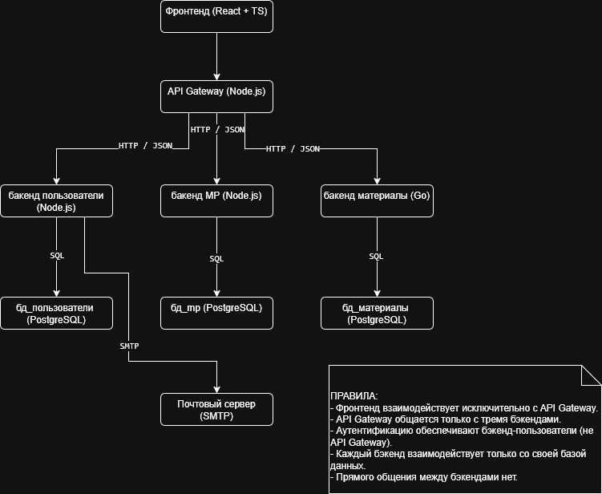
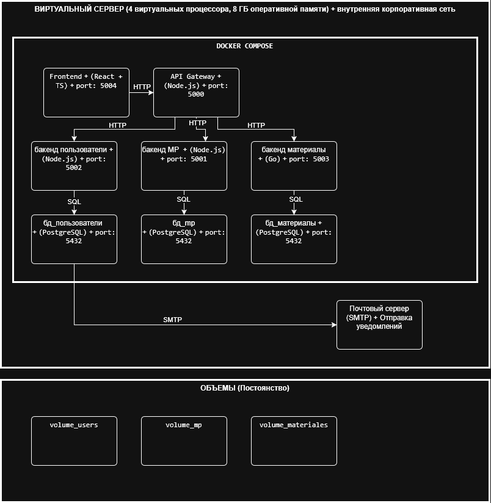

# 12. Компоненты и развертывание
_(Componentes y despliegue)_

---

## 1. Компоненты и границы ответственности
_(Componentes y límites de responsabilidad)_

| Компонент              | Технология         | Ответственность                                         | Что НЕ делает                                |
| ---------------------- | ------------------ | ------------------------------------------------------- | -------------------------------------------- |
| **Frontend**           | React + TypeScript | Интерфейс пользователя, формы, списки, дашборды         | Нет логики бизнеса, нет доступа к БД         |
| **API Gateway**        | Node.js            | Точка входа, маршрутизация запросов                     | Нет логики бизнеса, НЕ делает аутентификацию |
| **Backend Users**      | Node.js            | Пользователи, роли, аутентификация (JWT), сессии, аудит | Нет управления заявками, материалами         |
| **Backend MP**         | Node.js            | Заявки (тикеты), телефоны, линии, диагностика, работы   | Нет управления пользователями, материалами   |
| **Backend Materiales** | Go                 | Материалы, инвентарь, учет расхода                      | Нет управления заявками, пользователями      |
| **bd_users**           | PostgreSQL         | Данные пользователей, ролей, сессий                     | -                                            |
| **bd_mp**              | PostgreSQL         | Данные заявок, телефонов, линий, диагностик, работ      | -                                            |
| **bd_materiales**      | PostgreSQL         | Данные материалов, инвентаря, расхода                   | -                                            |
| **Сервер SMTP**        | -                  | Отправка email уведомлений                              | -                                            |

---

## 2. Интерфейсы компонентов
_(Interfaces de componentes)_

**Протокол:** HTTP / JSON

**Контракт ошибок:**

```json
{
  "error": {
    "code": "UNAUTHORIZED",
    "message": "Токен недействителен или истек",
    "timestamp": "2024-01-01T00:00:00Z"
  }
}
```

*Коды ошибок:*

| Код | Значение            |
| :-- | :------------------ |
| 400 | Неверные данные     |
| 401 | Не аутентифицирован |
| 403 | Нет прав            |
| 404 | Не найдено          |
| 409 | Конфликт версий     |
| 500 | Внутренняя ошибка   |

## 3. Диаграмма компонентов

(Diagrama de componentes)



## 4. Внешние зависимости  
(Dependencias externas)  

| Система     | Протокол | Синхронность | Действие при сбое                             |
| ----------- | -------- | ------------ | --------------------------------------------- |
| SMTP сервер | SMTP     | Асинхронный  | Уведомления не отправляются, система работает |

Уведомления по email:  

| Событие                | Кому                    |
| ---------------------- | ----------------------- |
| Создание заявки        | Тестировщик, Супервизор |
| Назначение техника     | Техник                  |
| Закрытие заявки        | Тестировщик             |
| Регистрация материалов | Материальный менеджер   |


## 5. Инфраструктурные узлы и ресурсы  
(Nodos de infraestructura y recursos)  

| Сервис             | CPU          | RAM       |
| ------------------ | ------------ | --------- |
| API Gateway        | 0.5 vCPU     | 512 MB    |
| Backend Users      | 0.5 vCPU     | 512 MB    |
| Backend MP         | 0.5 vCPU     | 512 MB    |
| Backend Materiales | 0.3 vCPU     | 256 MB    |
| Frontend           | 0.3 vCPU     | 256 MB    |
| bd_users           | 0.5 vCPU     | 1 GB      |
| bd_mp              | 0.5 vCPU     | 1 GB      |
| bd_materiales      | 0.5 vCPU     | 1 GB      |
| **ИТОГО**          | **3.6 vCPU** | **~5 GB** |

Вывод: Сервер 4 vCPU, 8 GB RAM → достаточно.  

Резервное копирование: Автоматическое (сервер + данные)

## 6. Диаграмма развертывания

(Diagrama de despliegue)



## 7. Порты и сеть  
(Puertos y red)  

| Сервис             | Порт |
| ------------------ | ---- |
| API Gateway        | 5000 |
| Backend MP         | 5001 |
| Backend Users      | 5002 |
| Backend Materiales | 5003 |
| Frontend           | 5004 |
| bd_users           | 5432 |
| bd_mp              | 5433 |
| bd_materiales      | 5434 |

Сеть: Внутренняя сеть предприятия. Базы данных не доступны извне.  


## 8. Конфигурация (docker-compose.yml)  
(Configuración)  

```yaml
version: '3.8'

services:
  api-gateway:
    build: ./api-gateway
    ports:
      - "5000:5000"
    environment:
      - USERS_SERVICE_URL=http://backend-users:5002
      - MP_SERVICE_URL=http://backend-mp:5001
      - MATERIALES_SERVICE_URL=http://backend-materiales:5003

  backend-users:
    build: ./backend-users
    ports:
      - "5002:5002"
    environment:
      - DB_HOST=bd_users
      - DB_PORT=5432
      - DB_NAME=bd_users
      - SMTP_HOST=smtp.empresa.com
      - SMTP_PORT=587
    depends_on:
      - bd_users

  backend-mp:
    build: ./backend-mp
    ports:
      - "5001:5001"
    environment:
      - DB_HOST=bd_mp
      - DB_PORT=5432
      - DB_NAME=bd_mp
    depends_on:
      - bd_mp

  backend-materiales:
    build: ./backend-materiales
    ports:
      - "5003:5003"
    environment:
      - DB_HOST=bd_materiales
      - DB_PORT=5432
      - DB_NAME=bd_materiales
    depends_on:
      - bd_materiales

  frontend:
    build: ./frontend
    ports:
      - "5004:5004"
    depends_on:
      - api-gateway

  bd_users:
    image: postgres:15
    environment:
      - POSTGRES_DB=bd_users
      - POSTGRES_USER=app_user
      - POSTGRES_PASSWORD=${DB_PASSWORD}
    volumes:
      - volume_users:/var/lib/postgresql/data

  bd_mp:
    image: postgres:15
    environment:
      - POSTGRES_DB=bd_mp
      - POSTGRES_USER=app_user
      - POSTGRES_PASSWORD=${DB_PASSWORD}
    volumes:
      - volume_mp:/var/lib/postgresql/data

  bd_materiales:
    image: postgres:15
    environment:
      - POSTGRES_DB=bd_materiales
      - POSTGRES_USER=app_user
      - POSTGRES_PASSWORD=${DB_PASSWORD}
    volumes:
      - volume_materiales:/var/lib/postgresql/data

volumes:
  volume_users:
  volume_mp:
  volume_materiales:
```


## 9. Наблюдаемость  
(Observabilidad)  

Логи: `docker logs <container>`  

Метрики:  

| Метрика            | Что проверяет        |
| ------------------ | -------------------- |
| Статус контейнеров | Все сервисы работают |
| Время ответа API   | Производительность   |

Алерты:  

| Алерт                | Условие              | Действие         |
| -------------------- | -------------------- | ---------------- |
| Сервис не отвечает   | Контейнер остановлен | Проверка логов   |
| Высокая загрузка CPU | > 80% 10 минут       | Анализ процессов |


## 10. Безопасность и обновления  
(Seguridad y actualizaciones)  

Безопасность:  
- Внутренняя сеть предприятия  
- Аутентификация (JWT) → Backend Users  
- Базы данных доступны только из контейнеров backends  


## 11. Зависимости и риски  
(Dependencias y riesgos)  

| Компонент          | Зависит от                    | Риск                 | Снижение          |
| ------------------ | ----------------------------- | -------------------- | ----------------- |
| Frontend           | API Gateway                   | Нет интерфейса       | Мониторинг        |
| API Gateway        | Backend Users, MP, Materiales | Нет маршрутизации    | Health checks     |
| Backend Users      | bd_users, SMTP                | Нет входа, нет почты | Backup, ретраи    |
| Backend MP         | bd_mp                         | Нет заявок           | Backup            |
| Backend Materiales | bd_materiales                 | Нет материалов       | Backup            |
| Сервер             | Электричество, сеть           | Всё остановлено      | Ежедневный backup |
