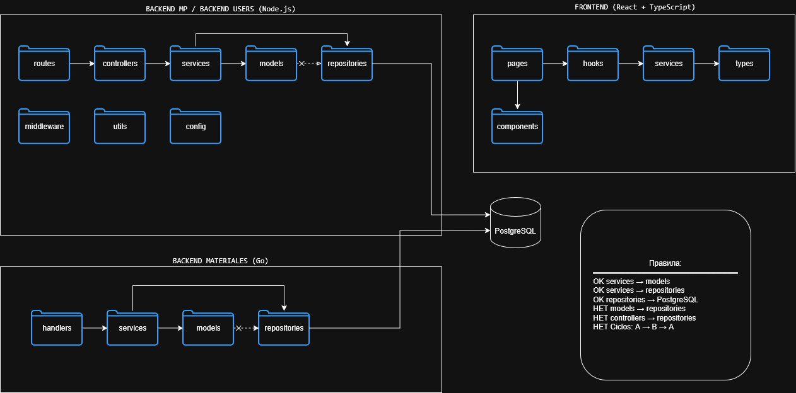

# 13. Структура библиотек и модульность
_(Estructura de bibliotecas y modularidad)_

---

## 13.1. Введение
_(Introducción)_

В данной практической работе проектируется модульная структура решения в виде библиотек и пакетов. Определяются правила зависимостей, исключающие циклы и утечки инфраструктуры в домен. Результат пригоден для реализации и тестирования.

_(En esta práctica se diseña la estructura modular de la solución en forma de bibliotecas y paquetes. Se definen reglas de dependencias que excluyen ciclos y fugas de infraestructura hacia el dominio. El resultado es apto para implementación y pruebas.)_

---

## 13.2. Перечень библиотек
_(Lista de bibliotecas)_

### 13.2.1. Backend MP и Backend Users (Node.js)

| Папка _(Carpeta)_ | Слой _(Capa)_      | Ответственность _(Responsabilidad)_                                        | Запрещено _(Prohibido)_                    |
| ----------------- | ------------------ | -------------------------------------------------------------------------- | ------------------------------------------ |
| `models/`         | **Domain**         | Сущности и бизнес-правила _(Entidades y reglas de negocio)_                | Импортировать `repositories/`, `services/` |
| `services/`       | **Application**    | Сценарии использования, оркестрация _(Casos de uso, orquestación)_         | Прямой доступ к БД                         |
| `controllers/`    | **Application**    | Обработка HTTP запросов, вызов services _(Manejo de peticiones HTTP)_      | Бизнес-логика                              |
| `repositories/`   | **Infrastructure** | Доступ к PostgreSQL _(Acceso a PostgreSQL)_                                | Бизнес-логика                              |
| `routes/`         | **Infrastructure** | Определение endpoints _(Definición de endpoints)_                          | Логика                                     |
| `middleware/`     | **Infrastructure** | Аутентификация, валидация, логи _(Autenticación, validación, logs)_        | Бизнес-логика                              |
| `config/`         | **Infrastructure** | Конфигурация, переменные окружения _(Configuración, variables de entorno)_ | -                                          |
| `utils/`          | **Infrastructure** | Вспомогательные функции, константы _(Helpers, constantes)_                 | Бизнес-логика                              |

### 13.2.2. Backend Materiales (Go)

| Папка _(Carpeta)_ | Слой _(Capa)_      | Ответственность _(Responsabilidad)_                       |
| ----------------- | ------------------ | --------------------------------------------------------- |
| `models/`         | **Domain**         | Сущности, бизнес-правила _(Entidades, reglas de negocio)_ |
| `services/`       | **Application**    | Сценарии использования _(Casos de uso)_                   |
| `handlers/`       | **Application**    | Обработка HTTP запросов _(Manejo de peticiones HTTP)_     |
| `repositories/`   | **Infrastructure** | Доступ к PostgreSQL _(Acceso a PostgreSQL)_               |

### 13.2.3. Frontend (React + TypeScript)

| Папка _(Carpeta)_ | Слой _(Capa)_      | Ответственность _(Responsabilidad)_                       |
| ----------------- | ------------------ | --------------------------------------------------------- |
| `components/`     | **Presentation**   | Переиспользуемые компоненты _(Componentes reutilizables)_ |
| `pages/`          | **Presentation**   | Страницы приложения _(Páginas de la aplicación)_          |
| `services/`       | **Infrastructure** | Вызовы API (axios) _(Llamadas a la API)_                  |
| `hooks/`          | **Presentation**   | Пользовательские хуки _(Custom hooks)_                    |
| `context/`        | **Presentation**   | React Context (Auth, Tickets)                             |
| `types/`          | **Contracts**      | TypeScript интерфейсы _(Interfaces TypeScript)_           |

---

## 13.3. Правила зависимостей
_(Reglas de dependencias)_

### 13.3.1. Backend MP / Users (Node.js)

| Правило _(Regla)_                         | Статус _(Estado)_       |
| ----------------------------------------- | ----------------------- |
| `models/` → `repositories/`               | ЗАПРЕЩЕНО _(PROHIBIDO)_ |
| `models/` → `services/`                   | ЗАПРЕЩЕНО _(PROHIBIDO)_ |
| `services/` → `models/`                   | РАЗРЕШЕНО _(PERMITIDO)_ |
| `services/` → `repositories/`             | РАЗРЕШЕНО _(PERMITIDO)_ |
| `controllers/` → `services/`              | РАЗРЕШЕНО _(PERMITIDO)_ |
| `controllers/` → `repositories/`          | ЗАПРЕЩЕНО _(PROHIBIDO)_ |
| `routes/` → `controllers/`                | РАЗРЕШЕНО _(PERMITIDO)_ |
| Циклы: services → repositories → services | ЗАПРЕЩЕНО _(PROHIBIDO)_ |

### 13.3.2. Backend Materiales (Go)

| Правило _(Regla)_             | Статус _(Estado)_       |
| ----------------------------- | ----------------------- |
| `models/` → `repositories/`   | ЗАПРЕЩЕНО _(PROHIBIDO)_ |
| `services/` → `models/`       | РАЗРЕШЕНО _(PERMITIDO)_ |
| `services/` → `repositories/` | РАЗРЕШЕНО _(PERMITIDO)_ |
| `handlers/` → `services/`     | РАЗРЕШЕНО _(PERMITIDO)_ |

### 13.3.3. Frontend (React + TypeScript)

| Правило _(Regla)_                                   | Статус _(Estado)_       |
| --------------------------------------------------- | ----------------------- |
| `types/` → никто не зависит _(no depende de nadie)_ |                         |
| `services/` → `types/`                              | РАЗРЕШЕНО _(PERMITIDO)_ |
| `hooks/` → `services/`                              | РАЗРЕШЕНО _(PERMITIDO)_ |
| `pages/` → `hooks/`, `components/`                  | РАЗРЕШЕНО _(PERMITIDO)_ |

---

## 13.4. Диаграмма пакетов
_(Diagrama de paquetes)_



## 13.5. Диаграмма классов (модели)
_(Diagrama de clases - models/)_

Примечание: Диаграмма классов домена уже представлена в Практической работе №5.
Диаграмма классов для библиотек повторяет ту же структуру сущностей,
поэтому здесь приведена только диаграмма пакетов.

(Nota: El diagrama de clases del dominio ya fue presentado en la Práctica No. 5.
El diagrama de clases para bibliotecas repite la misma estructura de entidades,
por lo que aquí solo se presenta el diagrama de paquetes.)

---

## 13.6. Контракты (TypeScript во Frontend)
_(Contratos - TypeScript en Frontend)_

Поскольку DTO не используются в бэкенде, контраты определены в папке `types/` фронтенда.
_(Como no se usan DTO en el backend, los contratos están definidos en la carpeta `types/` del frontend.)_

```typescript
// types/ticket.ts
_(types/ticket.ts)_

export interface Ticket {
  id: number;
  descripcion: string;
  prioridad: 1 | 2 | 3 | 4 | 5;
  estado: 'Открыта' | 'Проверена' | 'Назначена' | 'Ожидает' | 'Решена' | 'Закрыта';
  clienteId: number;
  clienteNombre: string;
  telefonoId?: number;
  lineaId?: number;
  fechaCreacion: Date;
  fechaCierre?: Date;
}

export interface CreateTicketDTO {
  clienteId: number;
  descripcion: string;
  telefonoId?: number;
  lineaId?: number;
}

export interface TicketResponse {
  success: boolean;
  data?: Ticket;
  error?: {
    code: string;
    message: string;
  };
}

11.7. Правила именования
_(Reglas de nombramiento)_

| Проект (Proyecto) | Файлы (Archivos) | Формат (Formato)                           | Пример (Ejemplo)       |
| :---------------- | :--------------- | :----------------------------------------- | :--------------------- |
| Backend (Node.js) | .js              | camelCase                                  | ticketService.js       |
| Backend (Go)      | .go              | snake_case                                 | material_repository.go |
| Frontend          | .ts, .tsx        | PascalCase (компоненты), camelCase (файлы) | TicketList.tsx         |
