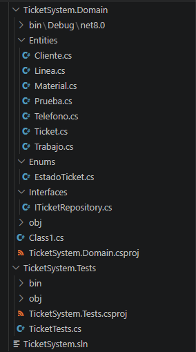
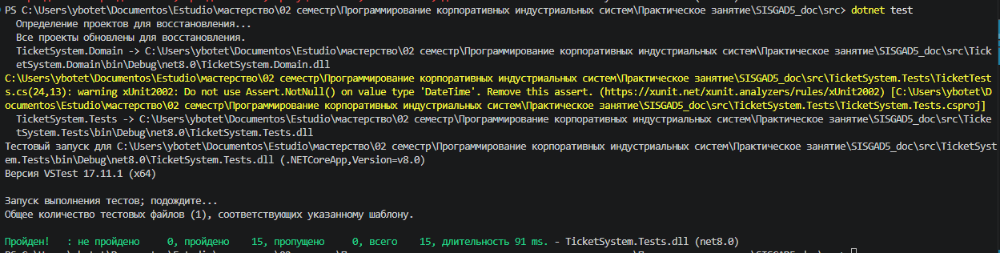

# 14. Реализация фрагмента UML в коде
_(Implementación de fragmento UML en código)_

---

## 14.1. Введение
_(Introducción)_

В данной практической работе выбранный фрагмент UML модели (8 классов, 1 перечисление, 1 интерфейс) переведен в код на языке C#. Реализованы инварианты, бизнес-ограничения, отношения между объектами и подготовлены модульные тесты.

_(En esta práctica, el fragmento seleccionado del modelo UML (8 clases, 1 enumeración, 1 interfaz) se ha traducido a código en lenguaje C#. Se han implementado invariantes, restricciones de negocio, relaciones entre objetos y se han preparado pruebas unitarias.)_

---

## 14.2. Выбранный фрагмент UML
_(Fragmento UML seleccionado)_

| №   | Класс _(Clase)_     | Тип _(Tipo)_                 | Описание _(Descripción)_                                           |
| --- | ------------------- | ---------------------------- | ------------------------------------------------------------------ |
| 1   | `Ticket`            | Сущность _(Entidad)_         | Управление жизненным циклом заявки                                 |
| 2   | `EstadoTicket`      | Перечисление _(Enumeración)_ | Состояния: Открыта, Проверена, Назначена, Ожидает, Решена, Закрыта |
| 3   | `Cliente`           | Сущность _(Entidad)_         | Данные клиента                                                     |
| 4   | `Telefono`          | Сущность _(Entidad)_         | Телефон, связанный с клиентом                                      |
| 5   | `Linea`             | Сущность _(Entidad)_         | Линия связи                                                        |
| 6   | `Prueba`            | Сущность _(Entidad)_         | Результаты диагностики                                             |
| 7   | `Trabajo`           | Сущность _(Entidad)_         | Работа по ремонту                                                  |
| 8   | `Material`          | Сущность _(Entidad)_         | Материалы для ремонта                                              |
| 9   | `ITicketRepository` | Интерфейс _(Interfaz)_       | Контракт доступа к данным                                          |

**Всего:** 8 классов + 1 перечисление + 1 интерфейс = 10 элементов

---

## 14.3. Таблица соответствия UML → C#
_(Tabla de correspondencia UML → C#)_

| Элемент UML _(Elemento UML)_             | Конструкция в C# _(Construcción en C#)_           | Пример из кода _(Ejemplo del código)_              |
| ---------------------------------------- | ------------------------------------------------- | -------------------------------------------------- |
| Класс _(Clase)_                          | `public class Nombre { }`                         | `public class Ticket { }`                          |
| Атрибут приватный _(Atributo privado)_   | `private tipo _nombre;`                           | `private EstadoTicket _estado;`                    |
| Свойство публичное _(Propiedad pública)_ | `public Tipo Nombre { get; private set; }`        | `public int Id { get; private set; }`              |
| Конструктор _(Constructor)_              | `public Nombre(параметры) { }`                    | `public Ticket(string descripcion, int clienteId)` |
| Метод публичный _(Método público)_       | `public void Metodo() { }`                        | `public void Cerrar() { }`                         |
| Исключение _(Excepción)_                 | `throw new Exception("mensaje")`                  | `throw new InvalidOperationException(...)`         |
| Ассоциация 1 : N _(Asociación 1:N)_      | `private readonly List<T> _items`                 | `private readonly List<Prueba> _pruebas`           |
| Композиция _(Composición)_               | Дочерний объект создается в конструкторе родителя | `_pruebas.Add(prueba)`                             |
| Перечисление _(Enumeración)_             | `public enum Nombre { Valor1, Valor2 }`           | `public enum EstadoTicket { Abierta, ... }`        |
| Интерфейс _(Interfaz)_                   | `public interface INombre { }`                    | `public interface ITicketRepository { }`           |
| Инвариант _(Invariante)_                 | Проверка в конструкторе или методе                | `if (prioridad < 1) throw ...`                     |

---

## 14.4. Структура проекта
_(Estructura del proyecto)_

---

## 14.5. Реализованные инварианты
_(Invariantes implementados)_

| №   | Инвариант _(Invariante)_                             | Где реализован _(Dónde se implementa)_ |
| --- | ---------------------------------------------------- | -------------------------------------- |
| 1   | Нельзя создать тикет без описания                    | Конструктор `Ticket`                   |
| 2   | Нельзя создать тикет без клиента                     | Конструктор `Ticket`                   |
| 3   | Приоритет должен быть от 1 до 5                      | Конструктор `Ticket`                   |
| 4   | Нельзя зарегистрировать тест в неверном состоянии    | Метод `Ticket.RegistrarPrueba`         |
| 5   | Нельзя назначить работника в неверном состоянии      | Метод `Ticket.AsignarTrabajador`       |
| 6   | Нельзя зарегистрировать работу в неверном состоянии  | Метод `Ticket.RegistrarTrabajo`        |
| 7   | Нельзя закрыть тикет в неверном состоянии            | Метод `Ticket.Cerrar`                  |
| 8   | Нельзя списать материалов больше, чем есть на складе | Метод `Material.ActualizarStock`       |

---

## 14.6. Результаты выполнения тестов
_(Resultados de ejecución de pruebas)_

